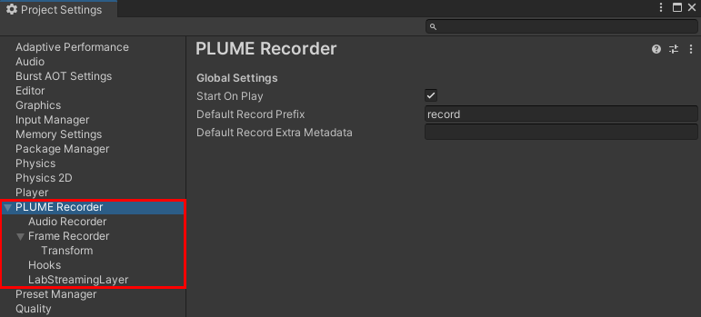
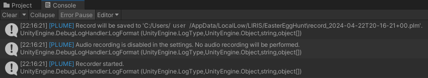

# Walkthrough

## The Easter Egg Hunt Experiment
"Easter Egg Hunt" is the Unity project that will follow us during the walkthrough of the PLUME Toolbox. It's a VR scene based on OpenXR and the XR Interaction Toolkit. In this VR game, users are immerged in a house and are tasked to find as much Easter Eggs as they can in under 2 minutes. They need to explore the entire house and interact with their environment to uncover the 25 hidden eggs.
PLUME will be used during every step of our experiment: PLUME Recorder, our recorder plugin for Unity is imported within the Easter Egg Hunt project; PLUME Viewer, our interactive player for XR data will be used to overview experiment sessions; PLUME Python, our analysis API will be used to insightful metrics. Code for this walkthrough is available <a href="https://github.com/liris-xr/PLUME-Demo">here</a>.

## Record your experiment with PLUME Recorder

### Install PLUME Recorder in your Unity project
!!! information
    PLUME Recorder is compatible with **Unity 2022 or later**.

1. Open the Package Manager window from `Window > Package Manager`.
2. Click on the `+` button at the top left of the Package Manager window.
3. Select `Add package from git URL...`.
4. Paste the Git URL into the text field: `https://github.com/liris-xr/PLUME-Recorder.git`
5. Click on the `Add` button.
6. Unity will now download and import the package into your project.

    

!!! success
    The recorder is now installed and ready to record.

### Configure the recorder
PLUME Recorder settings panel is located inside the `Project Settings` window. Settings are accessible directly from `PLUME > Settings`.

    

Default settings for the recorder are:

* Recording starts when the application is launched.
* Audio is **not** recorded.
* Update rate is set to 140 frames per second. This number is a **maximum** number of frame per second recorded.
* Thresholds to trigger record of Transform changes is 0.001 meter for position and scale and 0.001 radian for rotation.
* Lab Streaming Layer streams can be picked up for recording.

Details on settings can be found [here](../recorder/global-settings.md)

### Let's record our experiment !
Press the `Play` button. After a short loading time, PLUME Recorder will log information in the Unity console.

    

Record files are saved in the <a href="https://docs.unity3d.com/ScriptReference/Application-persistentDataPath.html">application persistent data path</a>.

??? example "Application persistent data path for every platform (from Unity Documentation)"
    Windows Store Apps: Application.persistentDataPath points to __C:\\Users\\*user*\\AppData\\LocalLow\\*company name*__.

    Windows Editor and Standalone Player: Application.persistentDataPath usually points to __%userprofile%\\AppData\\LocalLow\\*companyname*\\*productname*__.

    WebGL: Application.persistentDataPath points to __/idbfs/*md5 hash of data path*__ where the data path is the URL stripped of everything including and after the last '/' before any '?' components.

    Linux: Application.persistentDataPath points to __$XDG_CONFIG_HOME/unity3d__ or __$HOME/.config/unity3d__.

    iOS: Application.persistentDataPath points to __/var/mobile/Containers/Data/Application/*guid*/Documents__.

    tvOS: Application.persistentDataPath is not supported and returns an empty string.

    Android: Application.persistentDataPath points to __/storage/emulated/*userid*/Android/data/*packagename*__ files on most devices.

    Mac: Application.persistentDataPath points to the user Library folder. (This folder is often hidden.) User data is written into __~/Library/Application Support/*company name*/*product name*__.

If you encounter any errors or issues, please <a href="https://github.com/liris-xr/PLUME-Recorder/issues">create an issue</a> or [contact us](../contact).

## Overview your experiment with PLUME Viewer

## Analyze your experiment with PLUME Python