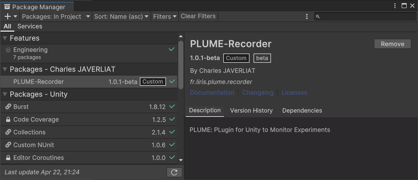

# Record your Easter egg hunt

## Download *Easter Egg Hunt* Unity Project
Code for the Easter Egg Hunt project is available [here](https://github.com/liris-xr/PLUME-Demo).

Once downloaded, open the `PLUME-Demo/EasterEggHunt/Unity` folder with Unity Hub.

!!! information
    Easter Egg Hunt was developed using **Unity 2022.3.21f**. Before opening the project, make sure to install **Unity 2022.3** or later.

## Manage PLUME-Recorder package
PLUME-Recorder is pre-installed in the project. You can update the package using the Package Manager window from `Window > Package Manager`.

## Configure the recorder
### Default Settings
=== "Auto-Start"

    Recording automatically starts when the application is launched.

=== "Audio"

    Audio Recorder is **disabled**, audio won't be recorded.

=== "Update Rate"

    Update rate is set to 140 frames per second. It specifies the **maximum** number of frame per second recorded, but PLUME will record at application rate if under.

=== "Transform Recording Thresholds"

    Thresholds to trigger record of Transform changes is 0.001 for position and scale and 0.001 for rotation.

=== "Lab Streaming Layer"

    Lab Streaming Layer streams can be picked up for recording.

### Settings Panel
If you want to configure PLUME-Recorder, the settings panel is located inside the `Project Settings` window which is accessible directly from `PLUME > Settings`.

To get more details on settings go to the PLUME-Recorder [global settings page](../recorder/global-settings.md).

    

## Create you first record
* Unity Editor: Press the `Play` button to start egg hunting!
* PC VR: Build your application for Windows. Launch the executable of your built application.
* Standalone VR: Build your application for your Android powered HMD. Launch your applition within your headset OS.

You have 2 minutes to find as much eggs as you can. You can teleport around the virtual environment using the joystick on your controller. To pick up an egg, simply hover your controller over the egg.

!!! information
    Easter Egg Hunt was developed using [OpenXR](https://docs.unity3d.com/Packages/com.unity.xr.openxr@1.11/manual/index.html) and [XR Interaction Toolkit](https://docs.unity3d.com/Packages/com.unity.xr.interaction.toolkit@2.5/manual/index.html). To run the application, you can use any compatible VR headset. Make sure the software for your headset is defined as the default runtime for OpenXR.

If recording has successfully started, PLUME will display the information messages in the console or in [Unity log files](https://docs.unity3d.com/Manual/LogFiles.html). Recording is automatically stopped when quitting the application.

    

Record files are saved in the <a href="https://docs.unity3d.com/ScriptReference/Application-persistentDataPath.html">application persistent data path</a>, the path is different depending on your operating system:

* Windows: `C:/Users/<user>/AppData/LocalLow/<company name>`
* Android: `/storage/emulated/<userid>/Android/data/<packagename>/files`
* iOS: `/var/mobile/Containers/Data/Application/<guid>/Documents`

## Issues with this step of the walkthrough ?

If you encounter any errors or issues, please <a href="https://github.com/liris-xr/PLUME-Recorder/issues">create an issue</a> or [contact us](../contact.md).
