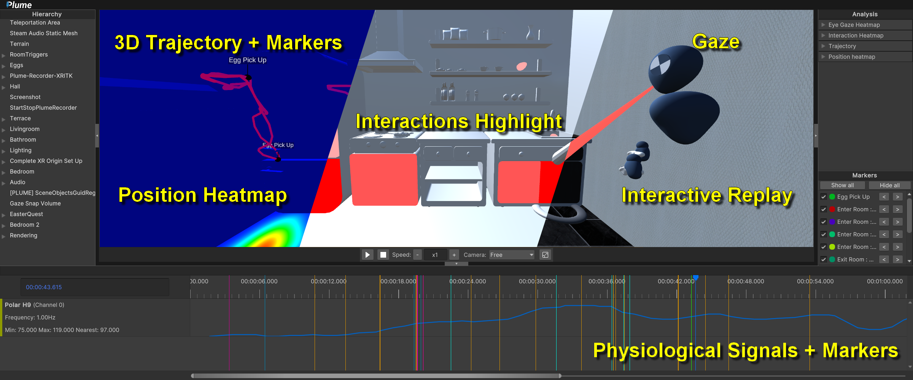

# Home

    
     
     
    

PLUME is an open-source software (GPLv3) toolbox that allows for the exhaustive record of behavioral data (including synchronous physiological signals), their offline interactive replay and analysis (see [an example](./demonstration/index.md)), and their easy sharing due to our compact and interoperable data format. PLUME is composed of three main tools:

- [PLUME Recorder](./recorder/index.md) for recording data from any Unity applications.
- [PLUME Viewer](./viewer/index.md) for replaying records and in-situ analysis.
- [PLUME Python](./python/index.md) for ex-situ analysis.

<iframe width="560" height="315" src="https://www.youtube.com/embed/W-mJ2LHNE8M?si=YXL44WO0H1Llyz0D" title="YouTube video player" frameborder="0" allow="accelerometer; autoplay; clipboard-write; encrypted-media; gyroscope; picture-in-picture; web-share" referrerpolicy="strict-origin-when-cross-origin" allowfullscreen></iframe>

We believe that PLUME can greatly benefit the scientific community by making the use of behavioral and physiological data available to as many people as possible, contributing to the reproducibility and replicability of user studies using virtual environments (XR, game design, etc), enabling the creation of large datasets, and contributing to a deeper understanding of user experience.