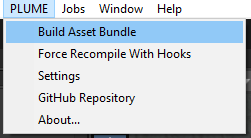

# Build the asset bundle

PLUME records are compact files that contains behavioural data, application state, physiological signals, markers, etc. To keep it light-weight, assets used in application (e.g., meshes, materials, lightmaps, etc.) are not saved within the PLUME record files, as they would be redundant across recordings, and are not essential for [ex-situ analysis](ex-situ_analysis.md). However, as these assets are necessary to [replay the experiment](replay.md) and for [in-situ analysis](in-situ_analysis.md), PLUME is delivered with an asset bundle build script. This script will collect assets dependencies from the built scenes and compress them.

!!! info
    The asset bundle is required to replay the experiment in PLUME-Viewer, but not for external analysis with PLUME-Python.

{width=250, align="right"}

1. Click on `PLUME -> Build Asset Bundle` to build the Asset Bundle.
2. The asset bundle only includes assets dependencies from the scenes specified in the build settings. Make sure the scenes you want to include are selected.
3. The built Asset Bundle is located in your project's folder, under `Assets/AssetBundles/plume_bundle.zip`

 

/// caption
The Asset Bundle is located in the project's folder under `Assets/AssetBundles/plume_bundle.zip`
///

!!! info
    Building the asset bundle can be done at any time. If you change the assets in your scenes, make sure to rebuild the asset bundle to include the updated assets, otherwise you might encounter inconsistencies when replaying the experiment.

!!! info
    When no scene is selected in the build settings, the currently opened scene will be used to build the asset bundle.