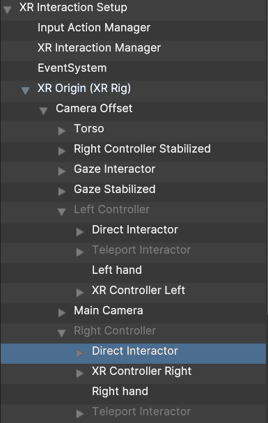
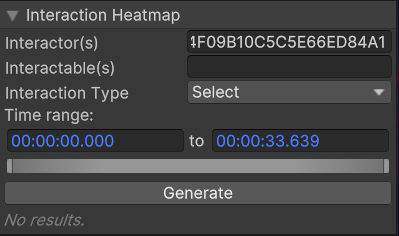
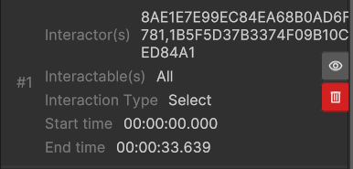

# Analyzing data in-situ
In-situ analysis is the process of analyzing data within its original 3D context. This is particularly valuable for understanding physiological signals, gaze data, and user interactions in relation to the user actions within the virtual environment. By visualizing data directly in 3D—such as heatmaps, trajectories, or event markers—researchers can better interpret user behavior and experiment dynamics. For this task, we provide PLUME Viewer, a tool that allows users to replay and analyze recorded sessions in the fully reconstructed 3D scene. In this part of the tutorial, we will introduce its core features and demonstrate how it can be used to better understand the behaviour of the egg hunter.

## User trajectory
After recording a user exploring the virtual environment in search of Easter eggs, we can analyze their movements to better understand navigation patterns and spatial behavior. One key aspect of this analysis is tracking the user’s trajectory within the 3D space. Let's compute the trajectory of the user’s head to visualize their movement path, identify frequently visited areas, and assess how they navigated the environment during the search.

{width=400, align="left"}

In the interface, `Object ID` refers to the GUID of the object you want to compute the trajectory of.

1. Select Main Camera in the hierarchy. Navigate within the tree view to `XR Interaction Setup > XR Origin > Camera Offset > Main Camera`.
2. ``CTRL+C`` to copy the Main Camera GUID.
3. ``CTRL+V`` to paste the Main Camera GUID within the `Object ID` field.

 

Event markers can be displayed over the trajectory to give them spatial context. We created a marker named `Egg Pick Up`, that indicates everytime a user find an egg.

* To show the marker on the trajectory, type `Egg Pick Up` in the `Markers` text field of the Trajectory Analysis Module.

Teleportation is a frequently used locomotion solution for navigating in VR. As logging teleportation can be widly different from a project to another, we consider there was a teleportation when the position has changed from a defined quantity (e.g. 10cm) from one frame to the next.

* Teleportation Tolerance is the maximal distance in meter between 2 positions of the Object over which we consider a teleportation. It is set at 0.1m by default.
* Teleportation Segments. When enabled teleportations are displayed as dotted lines, otherwise they break the trajectory.

You can change the rendering parameters of the trajectory:
* Decimation Tolerance. (parameter of the decimation algorithm, lower value will complexify the trajectory, while higher values will simplify it)
* Include Rotation. When enabled, rotation gizmos are placed over the trajectory to indicate the rotation of the object at that point in time.
* Time Range. By default, the time range encompasses the entire record. If you want a specific time range to compute the trajectory, adjust it here using the text fields or the adjustable scroll bar.

{width=400, align="right"}

Finally, click on `Generate` to create the trajectory with your chosen parameters. 

* Once generated, the trajectory appears in the 3D view.

After generation, a trajectory result panel appears under the Trajectory module.

* You can hide the trajectory by clicking on the *eye symbol*.
* You can delete the trajectory by clicking on the *bin symbol*.

 

{width=600}
/// caption
Trajectory of the user's head and `Egg Pick Up` markers. The color of the trajectory corresponds to time, from blue (beginning of the trajectory) to red (end of the trajectory).
///

## User position heatmap
A position heatmap allows us to visualize the spatial distribution of the user’s presence by mapping their head position onto the floor of the virtual environment. Let's compute it to project the positions of the egg hunter's head, as this representation helps identify frequently visited areas, uncover search patterns, and highlight regions of interest where the they paused or focused their attention.

{width=400, align="left"}

In the interface, `Projection Caster` refers to the object of which you want to project the position.

1. Select Main Camera in the hierarchy. `XR Interaction Setup > XR Origin > Camera Offset > Main Camera`
2. ``CTRL+C`` to copy the Main Camera GUID.
3. ``CTRL+V`` to paste the Main Camera GUID within the Projection Caster field.

`Projection Receiver(s)` refers to GUID(s) of the object(s) you want to project the position on. Here we have to give the GUID of the floors.

<!-- !!! warning
    Currently this module only projects on existing models within the virtual environment. Make sure to have a ground or equivalent to project to. -->

1. Select Floors in the hierarchy. Floors is an empty GameObject that is the parent of every mesh that represent floors in the scene. 
2. ``CTRL+C`` to copy the Floors GUID.
3. ``CTRL+V`` to paste the Main Camera GUID within the Object ID field.
4. Be sure to enable `Include Children`, as this will pick up recursively every child of the every GUID in the Projection Receiver(s) list.

* Click on Generate. Heatmap generation starts, and dynamically evolves as the replay moves the user and the rest of the objects in the scene.
 

Once generated, shaders of objects in the 3D view are replaced with the heatmap shader. On the selected receivers, the heatmap is displayed. The heatmap is colored to infer the duration of the position, blue being 0s and red being maximum nb of seconds for 1 position.

{width=400, align="right"}

* You can go back to the original environement by clicking on the *eye symbol*.
* You can delete the heatmap by clicking on the *bin symbol*.
* You can export the heatmaps as point clouds by clicking on the *download symbol*. For every object that contains heatmap values, it is exported as a `.ply` file.

{width=600}
/// caption
Heatmap of the projection of the user's head positions on the floor, the more red the more time the user spent at this position.
///

!!! tip
    You can use [Cloud Compare](https://www.danielgm.net/cc/) to visualize the heatmap, by adding a scalar value at import.

## Highlight user interactions

!!! note
    This feature is only compatible with interactions emitted by the [Unity's XR Interaction Toolkit](https://docs.unity3d.com/Packages/com.unity.xr.interaction.toolkit@3.1/manual/index.html). [Pull Requests](https://github.com/liris-xr/PLUME-Recorder/pulls) to add compatibility for other VR packages are welcome.

{width="250", align="left"}

As the user explored the virtual environment searching for Easter eggs, they interacted with various objects along the way. PLUME's Interaction Highlight feature provide a visual representation of these interactions by shading interacted objects in different intensities of red. This allows us to quickly identify which objects were engaged with the most, revealing key areas of user interest and interaction patterns within the scene.

In the interface, `Interactor(s)` refers to the GUID of one or multiple interactors (i.e., Direct Interactor, Ray Interactor, Near-Far Interactor). In our example, we will compute the interactions the egg hunter made with its right hand.

1. Select Right Hand Direct Interactor in the hierarchy (XR Interaction Setup > XR Origin > Camera Offset > Main Camera > Right Hand > Direct Interactor)
2. ``CTRL+C`` to copy the Right Hand Direct Interactor GUID.
3. ``CTRL+V`` to paste the Right Hand Direct Interactor GUID within the Object ID field.

 

{width=400, align="right"}

`Interactable(s)` refers to the GUID of one or multiple interactables (i.e, XR Grab Interactable). We take every interactable into account.

1. Leave the Interactable(s) field empty if to consider every interactable in the scene.
2. Interaction Type: Hover (i.e., Touch), Select (i.e, Grab), Activate (i.e., Fire)
3. Select the `Hover` Interaction Type.
4. Click on `Generate`.

 

{width=400, align="right"}

Once generated, shaders of interactable objects in the 3D view are replaced with the highlight shader. The highlight's intensity is determined by comparing the number of interactions on a specific object to the most interacted-with object in the scene. The more interactions an object has relative to the maximum, the more intense its highlight appears.

* You can go back to the original environement by clicking on the *eye symbol*.
* You can delete the highlight by clicking on the *bin symbol*.

 

{width=600}
/// caption
Highlight of the objects hovered by the right hand of the user.
///

