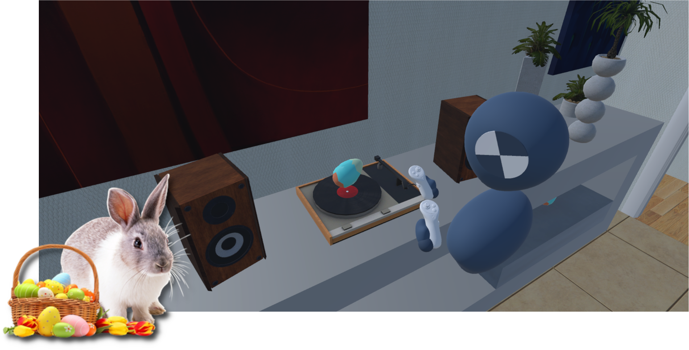

# Learn the basics

Welcome to the PLUME tutorial for beginners! This guide will help you get started with PLUME by recording your first experiment, reviewing it in the viewer and analyzing the data. To follow along with this tutorial, we've created a sample Unity project: a simple VR game where players hunt for Easter eggs against the clock.

{ width="700" }
/// caption
Screenshot of the Easter Egg Hunt project. The player is in a house and is looking for Easter eggs hidden in the environment.
///

By the end of this tutorial, you will have learned how to:

* How to record an experiment in the Unity Editor and in a standalone build
* How to replay and perform in-situ analysis of a record file in PLUME-Viewer
* How to perform ex-situ analysis of a record file with PLUME-Python

## Table of contents

- [Introduction](introduction.md)
- [Setup](setup.md)
- [Record your experiment](record.md)
- [Recording custom data](record_custom_data.md)
- [Build the asset bundle](build_asset_bundle.md)
- [Replay your experiment](replay.md)
- [Analyzing data ex-situ](ex-situ_analysis.md)
- [Analyzing data in-situ](in-situ_analysis.md)
- [Conclusion](conclusion.md)