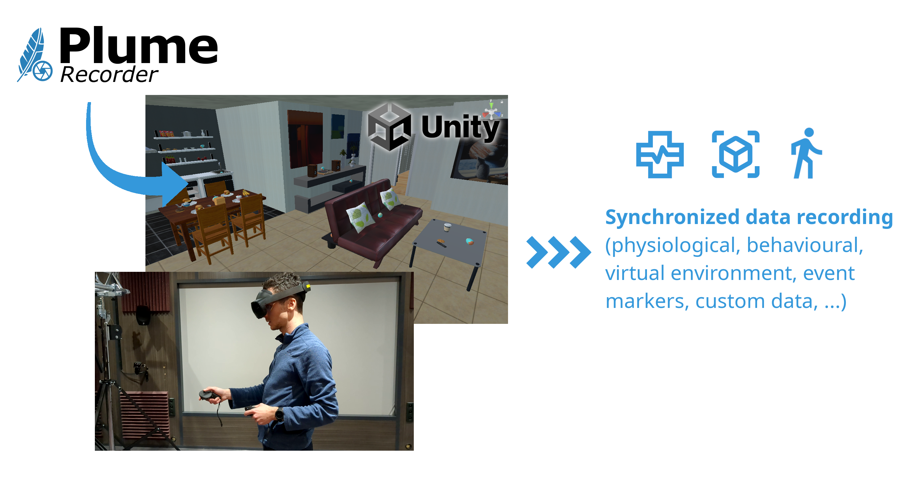
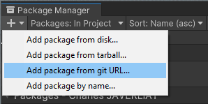
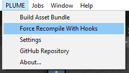
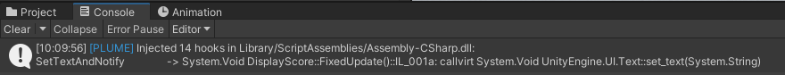
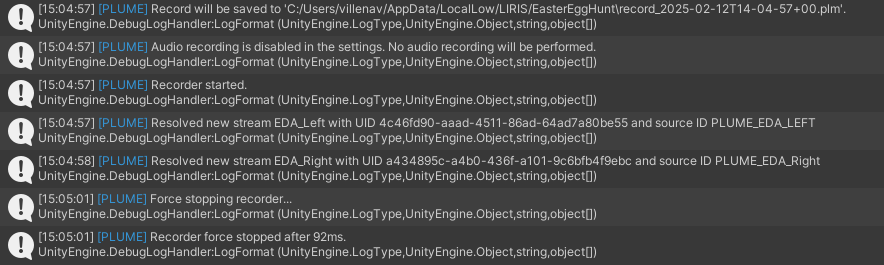

# Record your experiment

Now that you have the Easter Egg Hunt project ready, let's record your first experience with PLUME. We'll be using the PLUME Recorder, the core component of our toolbox. The PLUME Recorder is a Unity plugin that records the virtual environment, user behavior, and synchronized physiological signals into a single `.plm` file, without the need for extensive configuration and without having to modify the application's code. The plugin can be used on various type of projects (2D, 3D, XR), including multi-user experiences, and various platforms (Windows, Android, iOS), including standalone headsets.

{ width="700" }
/// caption
///

In the first part of this tutorial, you will get hands-on experience with PLUME Recorder. You will learn how to:

* Integrate PLUME Recorder into the Unity project
* Create a record, i.e., capture user interactions and behavioral data.
* Customize the record by adding event markers and physiological signals for richer data annotation.
* Build the application to enable deployment for data collection.
* Retrieve records, i.e., access recorded data for further analysis.

## Install PLUME-Recorder

!!! note
    PLUME Recorder requires Unity 2022 or later.

1. In Unity Editor, click on `Window -> Package Manager`.
{width=250, align="right"}
2. In the Package Manager window, click on `the + icon -> Add package from git URL...`
3. Within the text box, write ``https://github.com/liris-xr/PLUME-Recorder.git`` and click on add.
4. Close the Package Manager window.
{width=250, align="right"}
5. Click on `PLUME -> Force Recompile with Hooks`. This will add the necessary intermediate language hooks that detect changes in the scene at runtime.
6. Verify compilation went on as expected by checking Unity's Console Logs.

/// caption
///

!!! success
    PLUME-Recorder is now installed within your project.

## Create your first record

Now that PLUME Recorder is installed within your project, you're all set to create your first record! To ensure everything is working as expected before creating a build, we will test the application in the Unity Editor.

1. By default, recording begins automatically when the application starts. Click the `Play` button to start the application.
2. In the Easter Egg Hunt lobby, hit the `Start` button to begin the hunt when you are ready.
3. After completing the Easter Egg Hunt, the application should close automatically.
4. To confirm the recording went smoothly, check Unity's console logs, they should show messages indicating that the recording has successfully started and stopped. A message confirming pick up of LSL streams should also be logged.
5. You can find the generated record file in your user folder: ``C:/Users/<username>/AppData/LocalLow/<companyname>/<packagename>``.

///caption
///

PLUME is designed to record as much data as possible without requiring any additional configuration. This include the user's interactions, the environment state (game objects and components properties), event markers and custom data. In addition, PLUME integrate a compatibility layer with the Lab Streaming Layer (LSL) to record synchronized physiological signals and thus supports multi-channels and high frequencies signals (e.g. EEG, ECG, EDA, etc). **The data from those streams are recorded at their native frequency, independently from the application's refresh rate.** Any LSL stream that are open on the machine or the local network will be automatically picked up by PLUME.

## Recording in a build

The PLUME Recorder is designed to work in both the Unity Editor and in built applications, including PC-VR and standalone headsets. Similar to the Editor, the recording will start automatically when the application is launched. The recording will stop when the application is closed.

### On Windows
1. Click on `File -> Build Settings`.
2. Click on `Windows, Mac, Linux`. Click on `Switch Platform` if applicable.
3. Click on Build and Run.
4. Once the build is over, the application will launch on your computer.
5. The record file is saved in your user folder ``C:/Users/<username>/AppData/LocalLow/<companyname>/<packagename>``.

!!! note
    If the application is not displayed within your HMD, be sure that your VR backend (e.g., Steam VR or Meta Quest Link) is selected as the default Open XR runtime.

### On Android (e.g. Meta Quest)
1. Connect your Meta Quest HMD to your computer.
2. Click on `File -> Build Settings`
3. Click on `Android`. Click on `Switch Platform` if applicable.
4. Under Run Device, select your Meta Quest.
5. Once the build is over, the application will launch in the HMD.
6. The record file is saved in your Meta Quest's internal storage `/storage/emulated/<userid>/Android/data/<packagename>/files` or `/Shared Internal Storage/Android/data/<packagename>/files`.

!!! note
    If your Meta Quest does not appear in the Run Device list be sure to enable [Developper Mode](https://developers.meta.com/horizon/documentation/native/android/mobile-device-setup/)

### On iOS
1. Connect your iOS device to your computer.
2. Click on `File -> Build Settings`
3. Click on `iOS`. Click on `Switch Platform` if applicable.
4. Under Run Device, select your iOS device.
5. Once the build is over, the application will launch on your iOS device.
6. The record file is saved in your iOS device's internal storage `/var/mobile/Containers/Data/Application/<guid>/Documents`.
