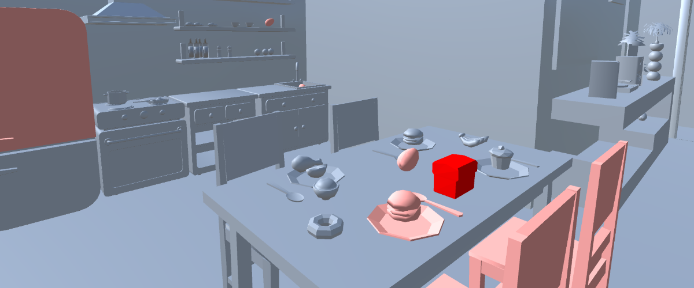

# Interaction highlight

With the interactions module, you can highlight objects that have been interacted with based on the recorded XRITK interactions. The interactions highlights analysis module contains the following parameters:

{ width="300", align="right" }

* Interactor(s): GUID of one or more interactor.
* Interactable(s) **(Optional)**: GUID of one or more interactable. If empty, every interactable in the scene will be taken into account.
* Interaction type: Interactions as defined by the [XR Interaction Toolkit](https://docs.unity3d.com/Packages/com.unity.xr.interaction.toolkit@2.0/manual/interactable-events.html).  Taking the example of a Direct (or near) Interactor, `Hover` corresponds to touching an interactable, `Select` corresponds to grabbing an interactable, `Activate` is a contextual interaction executed with a selected interactable.
* Time Range: section of the record you want the heatmap to be computed on. Leave as is to take the entire record into account.

 

Click on `Generate` to create the interaction heatmap with selected parameters. Generated heatmaps can be hidden from view (using eye icon) or deleted (using trash icon).

{ width="600" }
/// caption
Example of interaction highlight visualization.
///