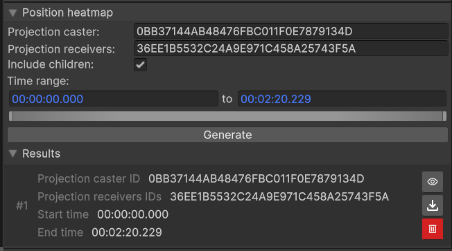

# Position Heatmap

With the position heatmap module, you can create heatmaps that show where objects have stayed the most. In practice, the position of the object is projected orthogonally towards the ground (-Y axis). The position heatmaps analysis module contains the following parameters:

{ width="300", align="right" }

* Projection Caster: GUID of the object you want to compute the heatmap for.
* Projection Receiver: GUID of one or more object for the heatmap to be projected on.
* Include children: if enabled, the projection will include the GUID inserted in 'Projection Receiver' and their children in the hierarchy.
* Time Range: section of the record you want the heatmap to be computed on. Leave as is to take the entire record into account.

 
Click on `Generate` to create the position heatmap with selected parameters. Generated heatmaps can be hidden from view (using eye icon) or deleted (using trash icon).

<figure>
    <video width="600" controls autoplay loop>
        <source src="../assets/position_heatmap_generation.mp4" type="video/mp4">
        Your browser does not support the video tag.
    </video>
    <figcaption>Realtime generation of the position heatmap in PLUME viewer of the user head mounted display projected on the floor of the scene.</figcaption>
</figure>

{ width="600" }
/// caption
Result of the position heatmap visualization. The duration of the stay is represented by the color intensity from blue (no time spent) to red (most time spent).
///