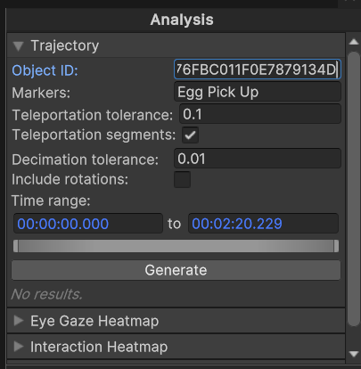
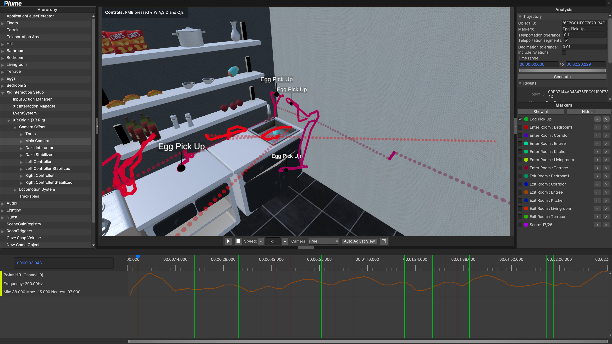

# 3D Trajectories

With the trajectory module, one can create 3D trajectories of any objects in the scene. The trajectory analysis module contains the following parameters:

{ width="250", align="right" }

* Object ID: GUID of the object you want to compute the trajectory for.
* Markers **(Optional)**: name of recorded markers, they are displayed above the trajectory.
* Teleportation tolerance: maximal distance in meter between 2 points before it is considered a teleportation.
* Teleportation segments: if enabled, teleportation will be displayed as dotted lines.
* Decimation Tolerance: largest decimation error (in m) that is allowed during the decimation process of the trajectory polyline.
* Include rotations: if enabled, rotation gizmo will be displayed above the trajectory.
* Time Range: section of the record you want the trajectory to be computed on. Leave as is to take the entire record into account.

 
Click on `Generate` to create the trajectory with selected parameters. Generated trajectories can be hidden from view (using the eye icon) or deleted (using trash icon).

{ width="600" }
/// caption
Result of the trajectory visualization. The trajectory is represented by a line, with markers displayed above it. It is colored using a gradient from blue (beginning) to red (end) to indicate its temporality.
///
