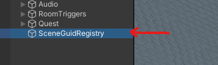
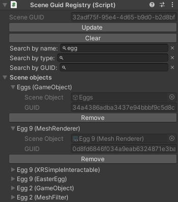
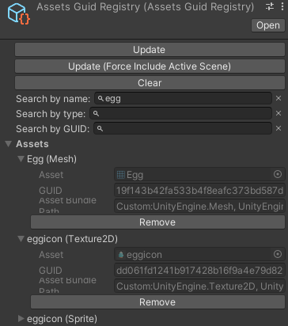

# Unique identification

To link back recorded data to the game object/component it belongs to, it is necessary to have some kind of unique identification system. Moreover, identifying objects across multiple executions is challenging but crucial for multi-record analysis (eg. aggregated heatmaps, trajectories, etc).

The Unity engine uses a GUID (Globally Unique IDentifier) system to identify objects across executions. However, this implementation is not available at runtime. As a consequence, we implemented our own GUID system to uniquely identify objects across executions, without the need for any custom component attached to the objects.

This plugin, named Unity-Runtime-GUID, is embedded in the recorder, its source code is [available on GitHub](https://github.com/cjaverliat/Unity-Runtime-GUID).

## GUID registries

GUIDs are stored inside registries, storing the correspondence between an object reference and the GUID itself (a 32 hexadecimal characters). Due to the different nature of objects (assets vs scene objects), GUID registries are split into `SceneGuidRegistry` and `AssetsGuidRegistry`.

The registries are automatically updated in the editor and embedded in builds to access the GUIDs at runtime. New objects dynamically created at runtime will get a randomly generated GUID assigned to them.

The entries contained in the GUID registries might reference different type of objects (GameObject, MeshRenderer, MonoBehaviour script, etc). Those can be filtered using the `Search by type` field. Objects can also be filtered by name using the `Search by name` field, this search is case-insensitive. Finally, one can find an object directly by its GUID using the `Search by GUID` field.

### Scene GUID registry

The `SceneGuidRegistry` contains the correspondences between each scene object and its GUID. The scene GUID registry is automatically created on build or when entering play mode in the Editor for each scene listed in the build settings or, if none, the currently opened scene.

<figure>

<figcaption>Exemple of a scene GUID registry in the editor hierarchy (left) and the component UI (right).</figcaption>
</figure>

### Assets GUID registry

The assets GUID registry is unique and is located in `Assets/Resources`. It contains the correspondences between each assets used in the scenes specified in the build settings or, if none, the currently opened scene. The `AssetsGuidRegistry` is automatically created on build or when entering play mode in the editor.
Entries of the assets GUID registry contains an additional property called `Asset Bundle Path`. This is used by the [PLUME Viewer](../viewer/index.md) to find the asset inside the [asset bundle](asset-bundle.md).

<figure>

<figcaption>Exemple of an assets GUID registry component UI.</figcaption>
</figure>