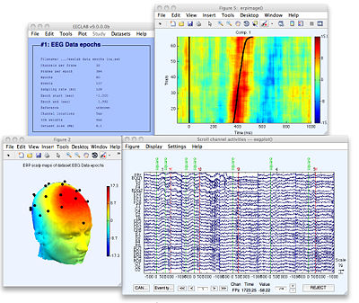

# Analyzing data ex-situ

PLUME record files are fully decoupled from the Unity engine. As a result, they can be parsed from any external applications. To further simplify the process, we provide a Python API to parse and extract data from the record files. This allows you to perform ex-situ analysis (i.e. analyzing the data outside its 3D context) using Python for more traditional analysis workflow (statistical analysis, machine learning, etc.). The package also comes with a set of utilities to simplify the conversion of the data to different formats used in data analysis like pandas dataframe, CSV and XDF for physiological signals to be analyzed in external software such as SigViewer, EEGLAB or MoBILAB.

---

## Installing PLUME Python

!!! note
    PLUME Python requires Python 3.10 or later.

In a Python environment (venv or conda), install the package using pip:

```bash
pip install plume-python
```

## Extracting data from a record file

<!-- Data preparation for generating the results -->
```python exec="on" session="basics-ex-situ-analysis" html="True"
from warnings import filterwarnings
from plume import RecordReader
import numpy as np
import plotly.graph_objects as go

filterwarnings("ignore")

# Replace fig.show() by hmtl output to display the plot in the page

def print_fig_html(fig):
    # center fig
    print("<center>")
    print(fig.to_html(full_html=False, include_plotlyjs="cdn"))
    print("</center>")

go.Figure.show = lambda fig: print_fig_html(fig)

record1 = RecordReader("docs/tutorials/beginner/basics/assets/record1.plm")
record2 = RecordReader("docs/tutorials/beginner/basics/assets/record2.plm")
```

!!! note
    Sample record files are available in the [tutorial repository](https://www.github.com/liris-xr/PLUME-Tutorial-Basics).

Record files data can be accessed through the `RecordReader` class, which offers convenient methods for navigating the
data. First, we need to import the necessary libraries and create a `RecordReader` object:

```python linenums="1"
from plume import RecordReader
import numpy as np
import plotly.graph_objects as go

record1 = RecordReader("path/to/record1.plm")
```

### Extracting properties of game objects/components over time

The record file contains a collection of frames, each representing the state of the game at a specific time. Each frame is organized hierarchically, with scenes containing game objects, which in turn contain components with their properties. The `RecordReader` class provides methods to access these elements. In practice, this allows us to extract the values of a specific property of a game object or component over time (i.e. transform position/rotation/scale, mesh and material properties, light color, etc.)

!!! warning
    All the component decoder classes are not yet implemented in PLUME Python, even though the data is present in the record file.

To start with a basic example, let's extract the position of a game object over time, and plot its 3D trajectory. For this, we need to collect the transform's world position of the object in each frame and store it in a list along with the time information.

```python exec="on" source="above" linenums="1" session="basics-ex-situ-analysis" title="Function to extract the position of an object over time"
def extract_object_positions_timeseries(record: RecordReader, scene_name: str, object_name: str) -> tuple[np.ndarray, np.ndarray]:
    time_s = []
    world_positions = []

    # We iterate over all frames in the record file
    for frame in record.frames:
        scene = frame.scenes.first_with_name(scene_name) # (1)

        # The scene may not exist in all frames, so we skip the frame if it is not found
        if scene is None:
            continue

        game_object = scene.game_objects.first_with_name(object_name) # (2)

        # The object may not exist in all frames, so we skip the frame if it is not found
        if game_object is None:
            continue
        
        # Access the transform component of the game object
        transform = game_object.transform # (3)

        world_position = transform.world_position
        world_positions.append(world_position)
        time_s.append(frame.time_s)

    # Convert the lists to numpy arrays
    return np.array(time_s), np.array(world_positions)
```

1.  Multiple scenes can have the same name, so the `first_with_name` function may not always return the desired element. We recommend using the GUID of the scene instead, and find it using `with_guid`.
2.  Multiple game objects can have the same name, so the `first_with_name` function may not always return the desired element. We recommend using the GUID of the game object instead, and find it using `with_guid`.
3.  You can access any component of the game object using the `game_object.components.with_type` or `game_object.components.first_with_type` method. For example, getting the mesh filter component of a game object would look like this:
```py
from plume.proxy.unity.component.mesh_filter import MeshFilter

# [...]

mesh_filter = game_object.components.first_with_type(MeshFilter)
```

Applying this to our example project, we can extract the position of the player's head over time. In the project, the main scene is called `EasterEggHunt` and the head object is called `Head`.

```python exec="on" source="above" linenums="1" session="basics-ex-situ-analysis" title="Extracting the player's head position over time" result="output"
head_time_s, head_world_positions = extract_object_positions_timeseries(record1, "EasterEggHunt", "Head")

print(f"head_time_s shape: {head_time_s.shape}")
print(f"head_world_positions shape: {head_world_positions.shape}")
```

Now that we have access to the position of the head over time, we can create various visualization, the simplest of which is plotting the 3D trajectory. We will use Plotly for this task. Let's start by defining a function that creates a trajectory 3D positions and a function to add custom data to this trajectory, in that case, the time information. We will make it so that the time is color-coded on the trajectory, and displayed in the hover tooltip.

```python exec="on" source="above" linenums="1" session="basics-ex-situ-analysis" title="Function to create a 3D trajectory"
import plotly.graph_objects as go

def create_trajectory_3d(positions: np.ndarray, name: str, line_width: int = 5, color: str = "red") -> go.Scatter3d:
    return go.Scatter3d(
        name=name,
        x=positions[:, 0],
        y=positions[:, 2], # We swap the y and z axis to match the Unity coordinate system (+y up)
        z=positions[:, 1],
        mode="lines",
        line=dict(
            color=color,
            width=line_width,
        ),
        hovertemplate=(
            "<b>X:</b> %{x:.2f}<br>" +
            "<b>Y:</b> %{y:.2f}<br>" +
            "<b>Z:</b> %{z:.2f}<br>"
        )
    )

def set_trajectory_custom_data(trajectory: go.Scatter3d, data: np.ndarray, data_name: str, data_units: str, cmap: str = "viridis") -> go.Scatter3d:
    trajectory.customdata = data
    trajectory.hovertemplate = (
        "<b>X:</b> %{x:.2f}<br>" +
        "<b>Y:</b> %{y:.2f}<br>" +
        "<b>Z:</b> %{z:.2f}<br>" +
        "<b>" + data_name + ":</b> " +
        "%{customdata:.2f}" + data_units
    )

    trajectory.line.color = data
    trajectory.line.colorbar = dict(title=f"{data_name} ({data_units})", x=-0.15)
    trajectory.line.colorscale = cmap
    return trajectory
```

Applying the function to the head, we get the following result:

```python exec="on" source="above" linenums="1" session="basics-ex-situ-analysis" title="Creating the head trajectory"
head_trajectory = create_trajectory_3d(head_world_positions, "Head trajectory")
head_trajectory = set_trajectory_custom_data(head_trajectory, head_time_s, "Time", "s")

fig = go.Figure()
fig.add_trace(head_trajectory)
fig.update_layout(
    title="Head trajectory in world space (m) over time (s)",
    scene=dict(
        xaxis_title="X",
        yaxis_title="Z",
        zaxis_title="Y",
        xaxis=dict(range=[-9, 3]),
        yaxis=dict(range=[-10, 1]),
        zaxis=dict(range=[0, 2.5]),
        aspectmode='manual',
        aspectratio=dict(x=12, y=11, z=2.5),
        camera_eye=dict(x=12, y=2, z=12)
    ),
    width=800,
    height=800
)
fig.show()
```

### Extracting markers

The record file also contains a collection of markers recorded by the application. Markers are used to signal specific events in the game and are simply a label associated with a time.

In our case, we recorded a marker labelled `Egg Pick Up` each time the player grabbed an egg. Let's say we want to add those markers on the trajectory, we start by creating a function to extracts the time information of the markers.

```python exec="on" source="above" linenums="1" session="basics-ex-situ-analysis" title="Extracting markers from the record"
def extract_marker_times(record: RecordReader, marker_label: str) -> tuple[np.ndarray]:
    time_s = []

    for marker in record.markers:
        if marker.label == marker_label:
            time_s.append(marker.time_s)

    return np.array(time_s)
```

Given the time information of the marker, we can find the last head position before each marker using the `np.searchsorted` function of numpy.

```python exec="on" source="above" linenums="1" session="basics-ex-situ-analysis"
egg_pick_up_time_s = extract_marker_times(record1, "Egg Pick Up")
egg_pick_up_positions = head_world_positions[np.clip(np.searchsorted(head_time_s, egg_pick_up_time_s), 0, len(head_world_positions) - 1)]
```

Now that we have the time and position of the markers, we can add them to the trajectory. For this, we create a 3D point for each marker at the corresponding position with the label displayed.

```python exec="on" source="above" linenums="1" session="basics-ex-situ-analysis" title="Function to create 3D markers with labels"
def create_markers_3d(positions: np.ndarray, time_s: np.ndarray, name: str, size: int = 4, color: str = "red", symbol: str = "circle") -> go.Scatter3d:
    return go.Scatter3d(
        x=positions[:, 0],
        y=positions[:, 2], # We swap the y and z axis to match the Unity coordinate system (+y up)
        z=positions[:, 1],
        mode="markers+text",
        text=[name] * len(positions),
        marker=dict(
            size=size,
            color=color,
            symbol=symbol,
            line=dict(width=0),
        ),
        name=name
    )
```

We can now apply the functions to our example.

```python exec="on" source="above" linenums="1" session="basics-ex-situ-analysis"
egg_pick_up_markers_3d = create_markers_3d(egg_pick_up_positions, egg_pick_up_time_s, "Egg Pick Up")
fig.add_trace(egg_pick_up_markers_3d)
fig.update_layout(
    title="Head trajectory in world space (m) over time (s) with `Egg Pick Up` markers",
    # We swap the y and z axis to match the Unity coordinate system
    scene=dict(
        xaxis_title="X",
        yaxis_title="Z",
        zaxis_title="Y",
        xaxis=dict(range=[-9, 3]),
        yaxis=dict(range=[-10, 1]),
        zaxis=dict(range=[0, 2.5]),
        aspectmode='manual',
        aspectratio=dict(x=12, y=11, z=2.5),
        camera_eye=dict(x=12, y=2, z=12)
    ),
    width=800,
    height=800
)
fig.show()
```

### Extracting physiological signals

TODO

```python exec="on" source="above" linenums="1" session="basics-ex-situ-analysis"
def extract_signals(record: RecordReader, signal_name: str) -> tuple[np.ndarray, np.ndarray]:
    time_s = []
    values = []

    for signal in record.signals:
        if signal.stream_info.name == signal_name:
            time_s.append(signal.time_s)
            values.append(signal.values)

    return np.array(time_s), np.array(values)
```

```python exec="on" source="above" linenums="1" session="basics-ex-situ-analysis"
eda_time_s, eda_values = extract_signals(record1, "EDA")
#TODO: check if they are correct eda values from record
resampled_eda_values = eda_values[np.clip(np.searchsorted(eda_time_s, head_time_s), 0, len(eda_values) - 1)]
resampled_eda_values = eda_values
```

Now let's plot the trajectory with the EDA signal color-coded on the trajectory.

```python exec="on" source="above" linenums="1" session="basics-ex-situ-analysis"
head_trajectory_with_eda = create_trajectory_3d(head_world_positions, "Head trajectory with EDA")
head_trajectory_with_eda = set_trajectory_custom_data(head_trajectory_with_eda, resampled_eda_values, "EDA", "µS")

fig = go.Figure()
fig.add_trace(head_trajectory_with_eda)

fig.update_layout(
    title="Head trajectory in world space (m) with EDA signal (µS)",
    # We swap the y and z axis to match the Unity coordinate system
    scene=dict(
        xaxis_title="X",
        yaxis_title="Z",
        zaxis_title="Y",
        xaxis=dict(range=[-9, 3]),
        yaxis=dict(range=[-10, 1]),
        zaxis=dict(range=[0, 2.5]),
        aspectmode='manual',
        aspectratio=dict(x=12, y=11, z=2.5),
        camera_eye=dict(x=12, y=2, z=12)
    ),
    width=800,
    height=800
)


fig.show()
```

#### Exporting physiological signals to XDF

In case you want to analyze the physiological signals in external software, you can export the signals to an XDF file. This file format is widely used in the field of neuroscience and allows you to import the signals in software like EEGLAB, MoBILAB, or SigViewer.

```python linenums="1"
from plume import export_xdf_from_record
export_xdf_from_record("path/to/record1.plm", "path/to/record1.xdf", include_markers=True)
```

For more details on the XDF format and its usage in external software, refer to the [Lab Streaming Layer documentation](https://labstreaminglayer.readthedocs.io/index.html).


/// caption
Example of an XDF file including EEG signals imported in EEGLAB. Source: [EEGLAB](https://sccn.ucsd.edu/eeglab/index.php)
///

### Extracting input actions

```python exec="on" source="above" linenums="1" session="basics-ex-situ-analysis"
def extract_input_actions(record: RecordReader, binding_path: str) -> tuple[np.ndarray, np.ndarray]:
    time_s = []
    values = []
    #TODO Investigate Error in input_action_decoder.py line 44, attribute name must be string, not 'NoneType
    for input_action in record.input_actions:
        if binding_path in input_action.binding_paths:
            time_s.append(input_action.time_s)
            values.append(input_action.value)

    return np.array(time_s), np.array(values)
```

```python exec="on" source="above" linenums="1" session="basics-ex-situ-analysis"
input_time_s, input_values = extract_input_actions(record1, "XRI Right Hand Interaction/Select")
```

!!! warning
    Composite bindings are not supported yet.

!!! note
    If you want to extract higher-level XRITK interactions (hover, activate, select), note that those are included in frames and accessible via `frame.xritk_interactions`. This is because XRITK interactions involves components present in a scene (XRInteractor and XRInteractable), and thus are frame-dependent in contrast to input actions that are not tied to specific frames.

<!-- Now a section about analyzing multiple records at the same time (e.g. comparing different conditions, subjects, etc.) -->
### Analyzing multiple records (inter-subject or intra-subject comparison)

In many scenarios, you may want to compare data from multiple records. For example, to compare different conditions, subjects, or sessions. To do this, you can load multiple records and extract the data as previously shown. Suppose we have two records, `record1` and `record2`:

```python linenums="1"
record1 = RecordReader("path/to/record1.plm")
record2 = RecordReader("path/to/record2.plm")
```

We can extract the data from both records as we did before:

```python exec="on" source="above" linenums="1" session="basics-ex-situ-analysis"
r1_head_time_s, r1_head_world_positions = extract_object_positions_timeseries(record1, "EasterEggHunt", "Main Camera")
r2_head_time_s, r2_head_world_positions = extract_object_positions_timeseries(record2, "EasterEggHunt", "Main Camera")

r1_head_trajectory = create_trajectory_3d(r1_head_world_positions, "Head trajectory (Record 1)")
r1_head_trajectory = set_trajectory_custom_data(r1_head_trajectory, r1_head_time_s, "Time", "s")

r2_head_trajectory = create_trajectory_3d(r2_head_world_positions, "Head trajectory (Record 2)")
r2_head_trajectory = set_trajectory_custom_data(r2_head_trajectory, r2_head_time_s, "Time", "s")

fig = go.Figure()
fig.add_trace(r1_head_trajectory)
fig.add_trace(r2_head_trajectory)
fig.update_layout(
    title="Head trajectory in world space (m) over time (s) for both records",
    # We swap the y and z axis to match the Unity coordinate system
    scene=dict(
        xaxis_title="X",
        yaxis_title="Z",
        zaxis_title="Y",
        xaxis=dict(range=[-9, 3]),
        yaxis=dict(range=[-10, 1]),
        zaxis=dict(range=[0, 2.5]),
        aspectmode='manual',
        aspectratio=dict(x=12, y=11, z=2.5),
        camera_eye=dict(x=12, y=2, z=12)
    ),
    width=800,
    height=800
)
fig.show()
```