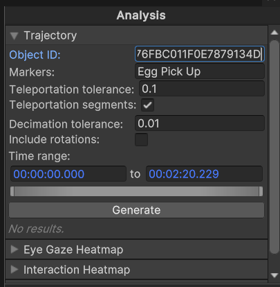

# In-situ analysis

In-situ analysis is the process of analyzing the data within the 3D context. This is particularly useful to contextualize data such as physiological signals or gaze data with the actions performed by the user in the virtual environment, or to visualize the data in the 3D space (3D heatmaps, trajectories, etc.).

The PLUME Viewer provides a set of module to perform in-situ analysis, we describe here the main ones.

## 3D Trajectories

With the trajectory module, one can create 3D trajectories of any objects in the scene.

{ width="300" }
/// caption
Trajectory module.
///

The trajectory analysis module contains the following parameters:

* Object ID: GUID of the object you want to compute the trajectory for.
* Markers **(Optional)**: name of recorded markers, they are displayed above the trajectory.
* Teleportation tolerance: maximal distance in meter between 2 points before it is considered a teleportation.
* Teleportation segments: if enabled, teleportation will be displayed as dotted lines.
* Decimation Tolerance: largest decimation error (in m) that is allowed during the decimation process of the trajectory polyline.
* Include rotations: if enabled, rotation gizmo will be displayed above the trajectory.
* Time Range: section of the record you want the trajectory to be computed on. Leave as is to take the entire record into account.

Click on `Generate` to create the trajectory with selected parameters. Generated trajectories can be hidden from view (using the eye icon) or deleted (using trash icon).

{ width="600" }
/// caption
Result of the trajectory visualization. The trajectory is represented by a line, with markers displayed above it. It is colored using a gradient from blue (beginning) to red (end) to indicate its temporality.
///

## Position Heatmap

With the position heatmap module, you can create heatmaps that show where objects have stayed the most. In practice, the position of the object is projected orthogonally towards the ground (-Y axis). The position heatmaps analysis module contains the following parameters:

* Projection Caster: GUID of the object you want to compute the heatmap for.
* Projection Receiver: GUID of one or more object for the heatmap to be projected on.
* Include children: if enabled, the projection will include the GUID inserted in 'Projection Receiver' and their children in the hierarchy.
* Time Range: section of the record you want the heatmap to be computed on. Leave as is to take the entire record into account.

{ width="600" }
/// caption
Position heatmap module.
///

Click on `Generate` to create the position heatmap with selected parameters. Generated heatmaps can be hidden from view (using eye icon) or deleted (using trash icon).

<figure>
    <video width="600" controls autoplay loop>
        <source src="../assets/position_heatmap_generation.mp4" type="video/mp4">
        Your browser does not support the video tag.
    </video>
    <figcaption>Realtime generation of the position heatmap in PLUME viewer of the user head mounted display projected on the floor of the scene.</figcaption>
</figure>

{ width="600" }
/// caption
Result of the position heatmap visualization. The duration of the stay is represented by the color intensity from blue (no time spent) to red (most time spent).
///

## Eye-gaze heatmap (Experimental 🧪)

!!! warning "Experimental feature"
    The eye-gaze heatmap is an experimental feature. It is still under development and may present some artifacts.

With the eye-gaze module, you can create heatmaps that show where the user looked at the most. In pratice, the direction of gaze is projected from the position of the eyes in a cone-shaped perspective towards the objects in the scene. The heatmap is bound to the objects, it takes into account occlusions and the dynamic nature of the scene.

<figure>
    <video width="600" controls autoplay loop>
        <source src="../assets/eye_gaze_heatmap_generation.mp4" type="video/mp4">
        Your browser does not support the video tag.
    </video>
    <figcaption>Presentation of the eye-gaze algorithm integrated in the viewer.</figcaption>
</figure>

The eye-gaze heatmap analysis module contains the following parameters:

* XR Camera: GUID of the Main Camera object.
* Projection Receiver: GUID of one or more object for the heatmap to be projected on.
* Include children: if enabled, the projection will include the GUID inserted in 'Projection Receiver' and their children in the hierarchy.
* Coordinate System: Tracking Space or Head Space. OpenXR doesn't push a standard for the coordinate system used by HMDs eye-tracker. Depending on your headset, recorded eye-gaze will have a different coordinate system (eg. Meta Quest Pro uses `Tracking Space`; HTC Vive Pro Eye uses `Head Space`).
* Time Range: section of the record you want the heatmap to be computed on. Leave as is to take the entire record into account.

{ width="600" }
/// caption
Eye-gaze heatmap module.
///

Click on `Generate` to create the interaction eye-gaze heatmap with selected parameters. Generated heatmaps can be hidden from view (using eye icon) or deleted (using trash icon).

{ width="600" }
/// caption
Result of the eye-gaze heatmap visualization. The duration of the gaze is represented by the color intensity from blue (no time spent) to red (most time spent).
///

## Interaction highlight

With the interactions module, you can highlight objects that have been interacted with based on the recorded XRITK interactions. The interactions highlights analysis module contains the following parameters:

* Interactor(s): GUID of one or more interactor.
* Interactable(s) **(Optional)**: GUID of one or more interactable. If empty, every interactable in the scene will be taken into account.
* Interaction type: Interactions as defined by the [XR Interaction Toolkit](https://docs.unity3d.com/Packages/com.unity.xr.interaction.toolkit@2.0/manual/interactable-events.html).  Taking the example of a Direct (or near) Interactor, `Hover` corresponds to touching an interactable, `Select` corresponds to grabbing an interactable, `Activate` is a contextual interaction executed with a selected interactable.
* Time Range: section of the record you want the heatmap to be computed on. Leave as is to take the entire record into account.

{ width="600" }
/// caption
Interaction highlight module.
///

Click on `Generate` to create the interaction heatmap with selected parameters. Generated heatmaps can be hidden from view (using eye icon) or deleted (using trash icon).

{ width="600" }
/// caption
Example of interaction highlight visualization.
///
