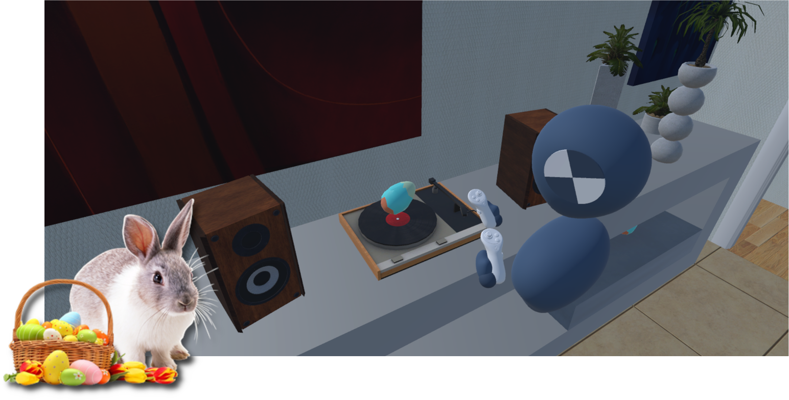

# Introduction

While virtual reality research often relies on self-reported data through questionnaires and interviews, the growing need for objective measurements has made behavioral and physiological data collection essential. However, collecting this data in XR environments remains technically challenging. PLUME is a toolbox that aims to address this challenge by providing a set of tool to easily <strong>record the virtual environment, user behavior, and synchronized physiological signals</strong> as exhaustively as possible, and perform <strong>in-situ</strong> and <strong>ex-situ</strong> analysis of the data. PLUME is composed of three main tools:

* [PLUME Recorder](https://github.com/liris-xr/PLUME-Recorder) for recording data from any Unity applications.
* [PLUME Viewer](https://github.com/liris-xr/PLUME-Viewer) for replaying records and in-situ analysis.
* [PLUME Python](https://github.com/liris-xr/PLUME-Python) for ex-situ analysis.

The following guide will help you get started with PLUME by recording your first experiment, reviewing it in the viewer and analyzing the data. To follow along with this tutorial, we've created a sample Unity project: a simple VR game where players hunt for Easter eggs against the clock. The project can be downloaded from the [PLUME-Tutorial-Basics](https://github.com/liris-xr/PLUME-Tutorial-Basics) repository.

{ width="700" }
/// caption
Screenshot of the Easter Egg Hunt project. The player is in a house and is looking for Easter eggs hidden in the environment.
///

## Table of contents

!!! warning
  TODO: Add table of contents