# Record your Easter Egg Hunt

The main component of the PLUME toolbox is the PLUME Recorder. The PLUME Recorder is a Unity plugin that records the virtual environment, user behavior, and synchronized physiological signals into a single `.plm` file, without the need for extensive configuration and without having to modify the application's code. The plugin can be used on various type of projects (2D, 3D, XR), including multi-user experiences, and various platforms (Windows, Android, iOS), including standalone headsets.

{ width="700" }
/// caption
///

In the first part of this tutorial, you will get hands-on experience with PLUME Recorder using a freely available VR Unity project —an Easter Egg Hunt— to explore data recording in a complex scene with interactions. You will learn how to:

* Integrate PLUME Recorder into the Unity project
* Create a record, i.e., capture user interactions and behavioral data.
* Customize the record by adding event markers and physiological signals for richer data annotation.
* Build the application to enable deployment for data collection.
* Retrieve records, i.e., access recorded data for further analysis.

---

## Download the Tutorial Files
* Option 1: Go on the [Tutorial GitHub](https://github.com/liris-xr/PLUME-Tutorial-Basics) page and download the repository as ZIP. Unpack the downloaded .zip file.
* Option 2: Clone the repository using the command line. If Git is not installed on your computer, you can [download it](https://git-scm.com/downloads).
```
git clone https://github.com/liris-xr/PLUME-Tutorial-Basics.git
```
## Open the Tutorial Unity Project
* Open Unity Hub.

!!! Note
    If Unity Hub is not installed on your computer, you can [download it](https://unity.com/download). From Unity Hub, you can install Unity 2022.3 or later. (*Optional*) If you want to build your application on an Android platform (e.g., Meta Quest), make sure to install the Android developer kit when installing Unity.

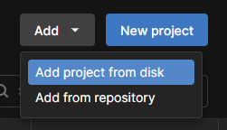{width="200", align="right"}

* In Unity Hub, add the project by clicking on `Add -> Add Project From Disk`. Select the Easter Egg Hunt folder located at `PLUME-Tutorial-Basics\Unity\EasterEggHunt`

* Open the Easter Egg Hunt project that has been added to your list of projects.

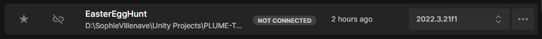
/// caption
///

!!! note
    If Unity issues a warning regarding the Editor version, you can confidently discard it and continue openning the project.

## VR Setup
### Option 1: VR HMD
* Click on `Edit -> Project Settings`.
* Under `XR Plug-in Management`, ensure `OpenXR` is enabled.

!!! warning
    In this window, you can manage both Desktop and Android projects. Make sure to configure for the platform want to build for.

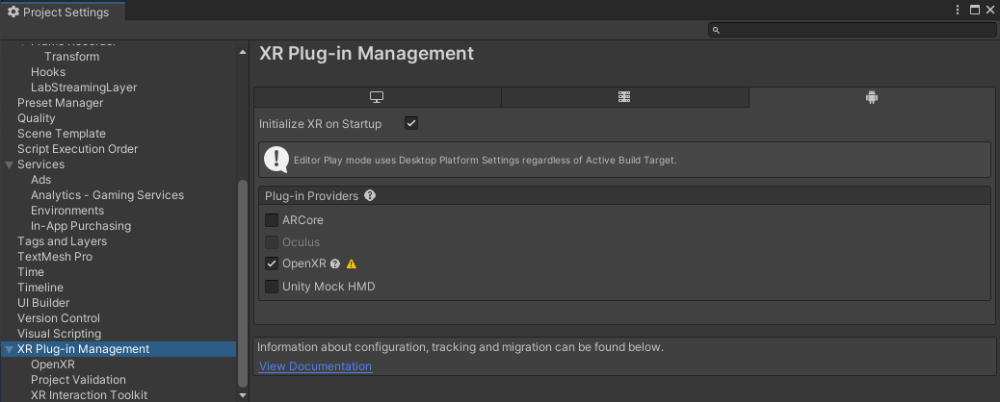

* Select the relevant Interaction Profile. E.g., `Oculus Touch Controller Profile` for Meta Quest.
* Select the relevant OpenXR Feature Groups to enable. E.g., `Meta Quest Support` when building for Meta Quest.

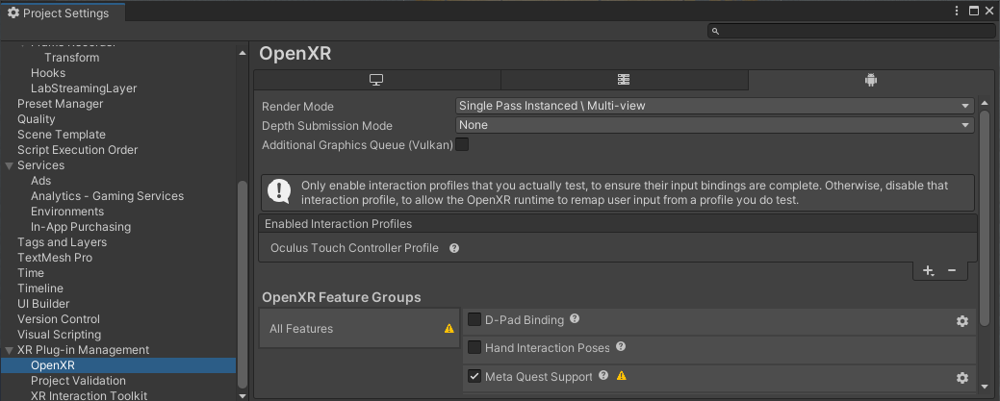

* Close the Project Settings Window.

### Option 2: XR Simulator Device
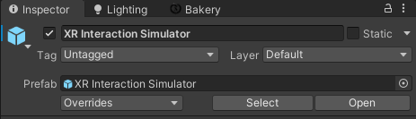{width="400", align="right"}
The [XR Interaction Toolkit (v3.1.0+)](https://docs.unity3d.com/Packages/com.unity.xr.interaction.toolkit@3.1/manual/index.html) provides an easy-to-use simulator of a VR HMD. The simulator prefab is already integrated within the Easter Egg Hunt project. Make sure it is enabled if you want to try the Easter Egg Hunt application on desktop.

<!-- /// caption
/// -->

## Install PLUME-Recorder
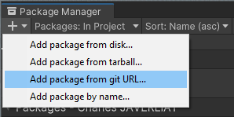{width=250, align="right"}

* In Unity Editor, click on `Window -> Package Manager`.

* In the Package Manager window, click on `the + icon -> Add package from git URL...`

* Within the text box, write ``https://github.com/liris-xr/PLUME-Recorder.git`` and click on add.

!!! success
    PLUME-Recorder is now installed within your project.

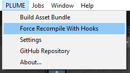{width=250, align="right"}

* Close the Package Manager window.
* Click on `PLUME -> Force Recompile with Hooks`. This will add the necessary intermediate language hooks that detect changes in the scene at runtime.

</br></br>

* Verify compilation went on as expected by checking Unity's Console Logs.

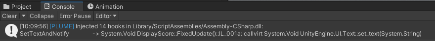
/// caption
///

## Create your First Record
Now that PLUME Recorder is installed within your project, you're all set to create your first record !

* By default, recording starts automatically. Press the `Play` button to test the application. Wait a few seconds and press `Stop`.
* To verify the installation, check the Unity's Console Logs. They should indicate the record has been successfully started and ended.

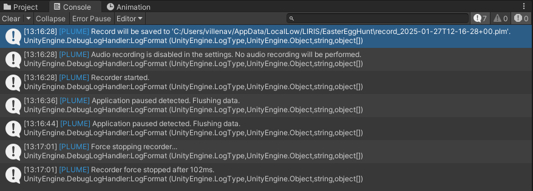
///caption
///

!!! info 
    When you are launching your application within the Unity Editor, record files are saved on your computer in your user folder

    ``C:\Users\your_username\AppData\LocalLow\LIRIS\EasterEggHunt``

## Build Easter Egg Hunt Asset Bundle
PLUME records are compact files that encompasses behavioural data and the application state. To keep it light-weight, assets used to develop the application (e.g., meshes, materials, lightmaps, etc.) are not saved within the PLUME record files. As these assets are necessary to replay the experiment in context of the virtual environment, PLUME is delivered with an Asset Bundle build script, that will collect dependencies from the built scenes and compress them. The built Asset Bundle will be used to [replay the records](replay.md) and perform [in-situ analysis](in-situ-analysis.md).

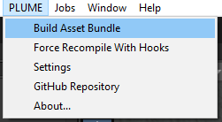{width=250, align="right"}

* Click on `PLUME -> Build Asset Bundle` to build the Asset Bundle.
* The asset bundle only includes assets dependencies from the scenes specified in the build settings. If no scene is selected, the currently opened scene will be used.

</br></br>

* The built Asset Bundle is located in your project's folder, under `Assets \ AssetBundles \ plume_bundle.zip`

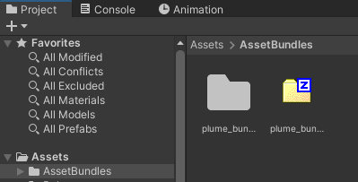
/// caption
///


## Customize your Record
PLUME Recorder is as exhaustive as possible when it comes to recording behavioural data, however you might want to add information to your records to fulfill your specific research needs. In this tutorial we will learn how to integrate event markers and physiological signals to our record.
### Markers
Markers are a simple and effective way of timestamping events hapenning in your application. We will lightly modify an existing script in our project to log when the user picks up an egg during the hunt.

* In Unity, navigate in the project's file, open the `Scripts` folder and open `EasterEgg.cs` with a C# IDE (e.g., [Visual Studio](https://visualstudio.microsoft.com/fr/vs/community/), [JetBrains Rider](https://www.jetbrains.com/fr-fr/rider/)).
```C# title="EasterEgg.cs"
using UnityEngine;
using UnityEngine.XR.Interaction.Toolkit;

[RequireComponent(typeof(UnityEngine.XR.Interaction.Toolkit.Interactables.XRSimpleInteractable))]
public class EasterEgg : MonoBehaviour
{
    public Quest quest;

    private UnityEngine.XR.Interaction.Toolkit.Interactables.XRSimpleInteractable _interactable;

    private void Start()
    {
        _interactable = GetComponent<UnityEngine.XR.Interaction.Toolkit.Interactables.XRSimpleInteractable>();
        _interactable.hoverEntered.AddListener(ObjectPickedUp);
    }

    private void ObjectPickedUp(HoverEnterEventArgs args)
    {
        quest.OnEggPickUp(this);
    }
}
```
!!! warning
    If your C# IDE does not recognize Unity classes and functions, thus not displaying autocompletion and compiling errors, ensure the Unity Editor uses your chosen IDE to open `.cs` files. In Unity click on `Edit -> Preferences`. Under External Tools, select your IDE. Unity installs Visual Studio Community by default.
* To use PLUME Recorder in your script, you need to import the associated namespace at the beginning of the file.
```C#
using PLUME.Core.Recorder;
```
* We want to log when the user picks up an egg. To do so, add the following line to the ```ObjectPickedUp``` function.
```C#
PlumeRecorder.RecordMarker("Egg Pick Up");
```
* Now, everytime this function is called, e.g. when a user picks up an egg, a timestamped marker "Egg Pick Up" will be recorded alongside other data.
```C# title="EasterEgg.cs"
using UnityEngine;
using UnityEngine.XR.Interaction.Toolkit;
using PLUME.Core.Recorder;

[RequireComponent(typeof(UnityEngine.XR.Interaction.Toolkit.Interactables.XRSimpleInteractable))]
public class EasterEgg : MonoBehaviour
{
    public Quest quest;

    private UnityEngine.XR.Interaction.Toolkit.Interactables.XRSimpleInteractable _interactable;

    private void Start()
    {
        _interactable = GetComponent<UnityEngine.XR.Interaction.Toolkit.Interactables.XRSimpleInteractable>();
        _interactable.hoverEntered.AddListener(ObjectPickedUp);
    }

    private void ObjectPickedUp(HoverEnterEventArgs args)
    {
        quest.OnEggPickUp(this);
        PlumeRecorder.RecordMarker("Egg Pick Up");
    }
}
```

### Physiological Signals
In addition to standard questionnaires, physiologicals signals captured during an experiment can be an effective mean of understanding the cognitive state of a user while immersed. PLUME relies on Lab Streaming Layer (LSL) to record synchronized physiological signals and thus supports multi-channels and high frequencies signals (e.g. for Electroencephalogram a.k.a EEG). Any LSL stream that are open on the machine or the local network will be automatically picked up by PLUME.

For this tutorial, you can use your own physiological device and create a LSL stream. Check the [list of supported devices](https://labstreaminglayer.readthedocs.io/info/supported_devices.html). Create your own stream using one of the [numerous implementations of LSL](https://github.com/labstreaminglayer).

#### Simulate a Physiological Signal Stream
If you don't have a physiological signal device at disposal, we provide you with pre-recorded EDA signals that we are going to stream using [PyLSL](https://github.com/labstreaminglayer/pylsl) and [PyXDF](https://github.com/xdf-modules/pyxdf). Our python script (`stream_eda.py`) is adapted from a [PyLSL example](https://github.com/labstreaminglayer/pylsl/blob/main/src/pylsl/examples/SendData.py) and sends 2 EDA signals sampled at 8Hz. To run the Python script, you will need a Python virtual environment with PyLSL and PyXDF installed.

Here a step-to-step guide to creating a new Python environment using Conda.

* Download and install [Miniconda or Anaconda](https://docs.anaconda.com/getting-started/).
* Open the `Anaconda Prompt` application
* Create a new Conda environment with Python 3.12
```
conda create --name my_env python==3.12
```
* Once created, activate the Conda virtual environment.
```
conda activate my_env
```
* In Anaconda Prompt, navigate to the tutorial files, enter the `Python\PhysiologicalSignals` folder.
* Install the required packages using pip and the following command:
```
pip install -r requirements.txt
```
* Launch `stream_eda.py` using the following command. Physiological streams can now be picked up by PLUME.
```
python stream_eda.py
```

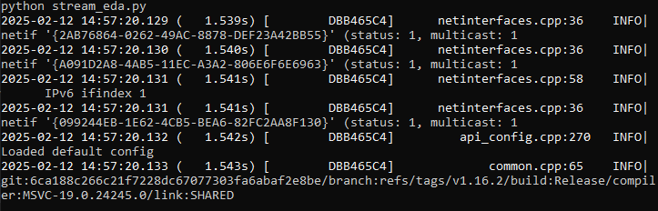
///caption
///


#### Recording physiological signals
* Go back to the Unity Editor.
* Click on the play button to test the application.
* A message confirming pick up of stream should be shown in the logs.

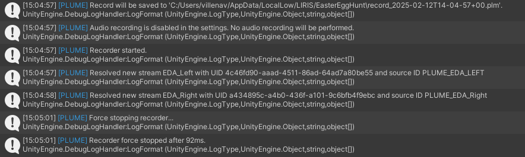


!!! success
    Physiological signals are now recorded synchronously with the rest of the VR experiment.

<!--
### Settings
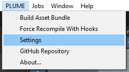{width="250", align="right"}

* To change PLUME configuration, settings are available from PLUME -> Settings.

<br><br><br>

#### General
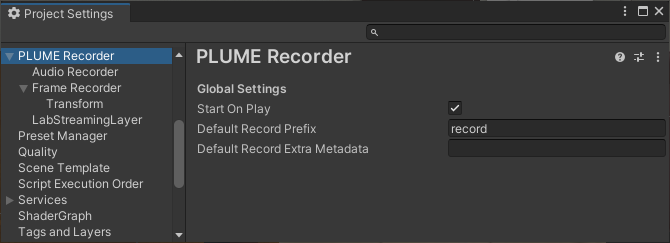
/// caption
General Settings Window 
///

#### Frame Recorder
#### Audio
#### Lab Streaming Layer
-->


## Build Easter Egg Hunt
PLUME Recorder can be integrated within your built applications, either you build for Windows or Android.

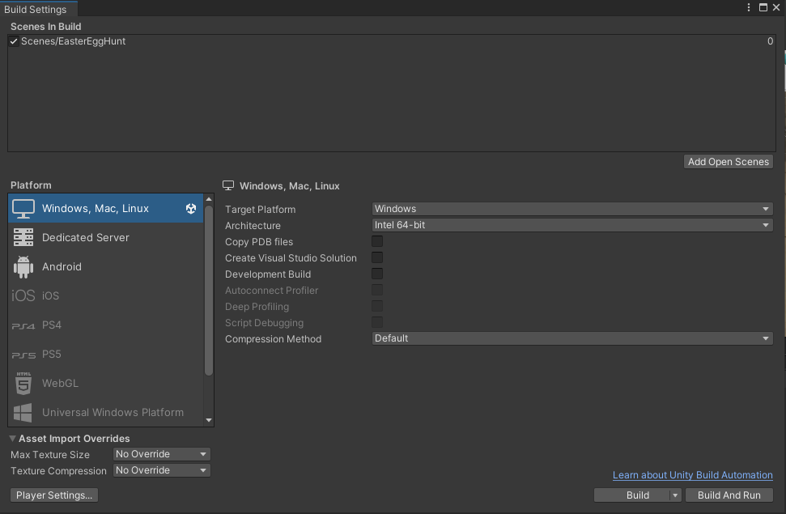
/// caption
Unity's Build Settings Window 
///

### Build for Windows
* Click on `File -> Build Settings`.
* Click on `Windows, Mac, Linux`. Click on `Switch Platform` if applicable.
* Click on Build and Run.
* Once the build is over, the application will launch on your computer.

!!! warning
    If the application is not displayed within your HMD, be sure that your VR backend (e.g., Steam VR or Meta Quest Link) is selected as the default Open XR runtime.

### Build for Meta Quest
* Connect your Meta Quest HMD to your computer.
* Click on `File -> Build Settings`
* Click on `Android`. Click on `Switch Platform` if applicable.
* Under Run Device, select your Meta Quest.
!!! warning
    If your Meta Quest does not appear in the Run Device list be sure to enable [Developper Mode](https://developers.meta.com/horizon/documentation/native/android/mobile-device-setup/)
* Once the build is over, the application will launch in the HMD.

## Hunt for the eggs !
* Start the Easter Egg Hunt and find all 25 eggs within the scene in under 2 minutes !
* Once your hunt is over, the application will close automatically.

### Retrieve your record on Windows
Record files are saved in your user folder ``C:\Users\your_username\AppData\LocalLow\LIRIS\EasterEggHunt``.

!!! tip
    To quickly access this folder, use the Windows *Execute..* shortcut (`Win+R`), type ``appdata`` and click on OK.

### Retrieve your record on Meta Quest
* Connect your Meta Quest to your computer.
* On connection, a notification appears in the HMD. Click on it to authorize access to the HMD's files.
* On your computer, access your HMD files, navigate to ``\Shared Internal Storage\Android\data\fr.liris.EasterEggHunt\files`` and copy both the `.plm` and `.plm.meta` files to your computer.