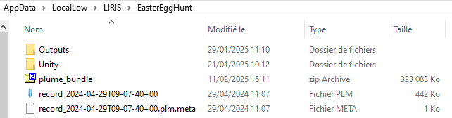

# Replay your Easter Egg Hunt

After recording your experience, you can replay it to ensure everything went as expected, analyze user behavior, or even for post-experiment debriefing. We will be using PLUME Viewer to replay our record. This standalone application is independent and completely decoupled from the initial Unity project used during recording. In practice, this means that anyone can replay a record of your experiment without having to send them your full Unity project.

<figure>
    <video width="700" controls autoplay loop>
        <source src="../assets/replay_lq.mp4" type="video/mp4">
        Your browser does not support the video tag.
    </video>
    <figcaption>Example video of a replay in PLUME Viewer from the Easter Egg Hunt.</figcaption>
</figure>

## Build the Asset Bundle
To replay a recording, you need to build an Asset Bundle of your application. The Asset Bundle include prefabs, textures, materials, meshes, etc. that are used in the application. This operation is required only once as assets are common to all application runs and prevents from embedding the assets in every record file.

* PLUME's Asset Bundle is automatically created when building the main application.
* The asset bundle only includes assets dependancies from the scenes specified in the build settings. If no scene is selected, the currently opened scene will be used.
* Within the Unity Editor, you can build the Asset Bundle separately by clicking on `PLUME -> Build Asset Bundle`.
* The built Asset Bundle is located in your project's folder, under `Assets \ AssetBundles \ plume_bundle.zip`
* To avoid giving PLUME-Viewer the location of the Asset Bundle everytime your start the application, copy the latest Asset Bundle next to your records.

/// caption
///

!!! tip
    Your records are located in ``C:\Users\your_username\AppData\LocalLow\LIRIS\EasterEggHunt`` on Windows and ``\Shared Internal Storage\Android\data\fr.liris.EasterEggHunt\files`` on Android.

## Download PLUME-Viewer
* Go to the PLUME-Viewer [releases page](https://github.com/liris-xr/PLUME-Viewer/releases).

/// caption
///

* Download the latest available release and unpack the downloaded `.zip` file.

## Open your .plm file with PLUME-Viewer
!!! tip 
    If you were unable to create a .plm, we provide a sample file to follow along this section of the tutorial.

* Option 1 : Launch PLUME-Viewer by clicking on the executable. You will be prompted with a window asking for your record file.
* Option 2 : Set PLUME-Viewer as the default application to open `.plm` files. To do so, `right-click on a .plm file -> Open With... -> Select PLUME-Viewer executable`. You can now directly double-click on a `.plm` file to open it with PLUME-Viewer.

!!! warning
    If you did not copy the Asset Bundle next to your records, PLUME-Viewer will prompt a window asking for the location of the Asset Bundle file.

## Replay your Easter Egg Hunt
* Once your record is loaded, replay starts automatically.
* Use the control bar to change the replay parameters.

* Play 
* Pause 
* Stop
* Replay Speed (from x0.25 to x5) 
* Camera. Main = Camera recorded in the application; Top View = Orthogonal Camera, Scroll to change cut plan, use left-click to navigate; Free = 3D Camera, Right Click + use W,A,S,D (forward/left/back/right) and Q,E (up/down) to navigate 
* While in Free Camera, click Auto Adjust View to place the Free Camera at the current Main Camera position. 
* Full Screen 
* Use the Timeline to navigate through your record.

## Markers
* During the first part of this tutorial, we edited a script to record an Event Marker every time the user picks up an Egg.
* Event Markers are listed on the panel on the right. 
* They also appear as bars on the Timeline. There is a color code to identify the bars.
* To change their display status on the Timeline, enable or disable them in the Markers panel.
* Click Show All or Hide All to enable or disable every marker.
* Markers can also be placed within 3D trajectories to emphasize their space-time relation with the session. We will see how to add visual markers to trajectories in the next section.