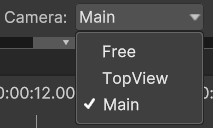
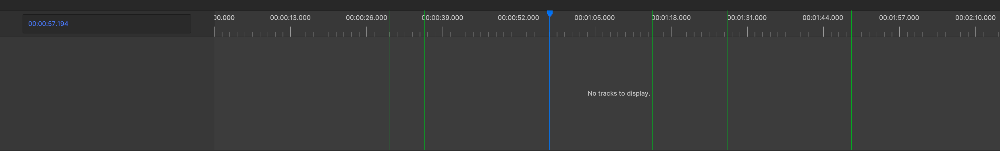

# Replay your Easter Egg Hunt

After recording your experience, you can replay it with PLUME Viewer to ensure everything went as expected, analyze user behavior, or even for post-experiment debriefing. This standalone application is independent and completely decoupled from the initial Unity project used during recording. In practice, this means that anyone can replay a record of your experiment without having to send them your full Unity project.

<figure>
    <video width="700" controls autoplay loop>
        <source src="../assets/replay_lq.mp4" type="video/mp4">
        Your browser does not support the video tag.
    </video>
    <figcaption>Example video of a replay in PLUME Viewer from the Easter Egg Hunt.</figcaption>
</figure>

## Download PLUME-Viewer
* Go to the PLUME-Viewer [releases page](https://github.com/liris-xr/PLUME-Viewer/releases).

/// caption
///

* Download the latest available release and unpack the downloaded `.zip` file.

## Open your .plm file with PLUME-Viewer
!!! tip 
    If you were unable to create a .plm, we provide [a sample file](record.md/#download-the-tutorial-files) to follow along this section of the tutorial.

* Retrieve the [built Asset Bundle](record.md#build-easter-egg-hunt-asset-bundle) which is located in your project's folder, under `Assets \ AssetBundles \ plume_bundle.zip`
* Copy the Asset Bundle next to your records for PLUME Viewer to automatically load it.
* _Reminder:_ Your records are located in ``C:\Users\your_username\AppData\LocalLow\LIRIS\EasterEggHunt`` on Windows and ``\Shared Internal Storage\Android\data\fr.liris.EasterEggHunt\files`` on Android.

!!! note
    If you did not copy the Asset Bundle next to your records, PLUME-Viewer will prompt a window asking for the location of the Asset Bundle.

/// caption
///

* Option 1 : Launch PLUME-Viewer by clicking on the executable. You will be prompted with a window asking for your record file.
* Option 2 : Set PLUME-Viewer as the default application to open `.plm` files. To do so, `right-click on a .plm file -> Open With... -> Select PLUME-Viewer executable`. You can now directly double-click on a `.plm` file to open it with PLUME-Viewer.

## Replay your Easter Egg Hunt
* Once your record is loaded, replay starts automatically.

/// caption
PLUME Viewer Media Bar.
///

* Media Bar Options
    - Play
    - Stop
    - Replay Speed (from x0.25 to x5)
    - Camera
    - Full Screen

{align="right"}

* Camera Options
    - Main: Camera view as recorded.
    - Top View: Orthogonal Camera. `Scroll` to change cut plan. `Left-click` to navigate.
    - Free: 3D Camera. `Right Click` + use `W,A,S,D` (forward/left/back/right) and `Q,E` (up/down) to navigate.

 

* While in Free Camera, click {width=100} to place the Free Camera at the position of the Main Camera position.

* Use the Timeline to navigate through your record.

/// caption
PLUME Viewer Timeline
///

## Markers
{width=300, align="right"}

* During the [first part of this tutorial](record.md/#markers), we edited a script to record an Event Marker every time the user picks up an Egg.
* Event Markers are listed on the panel on the right.
* Event Markers also appear as bars on the Timeline. The color code helps identify the bars.
* To change their display status on the Timeline, enable or disable them in the Markers panel.
* Click Show All or Hide All to enable or disable every marker.
* Markers can also be placed within 3D trajectories to emphasize their space-time relation with the session. We will see how to add visual markers to trajectories in the next section.