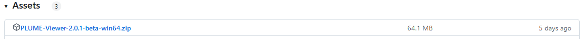
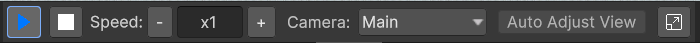
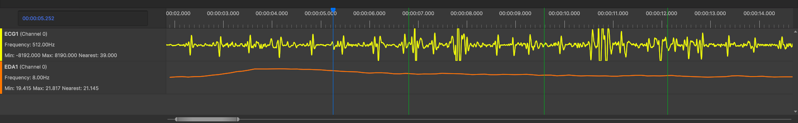
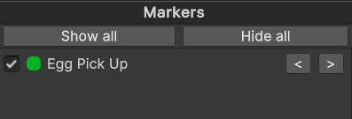

# Replay your experiment

After recording your experience, you can replay it with PLUME Viewer. This standalone application is independent and completely decoupled from the initial Unity project used during recording: a record can be replayed without having to send them your full Unity project. The PLUME Viewer recreates the scene as it was during the recording in 3D, providing richer context than a simple video recording for [in-situ analysis](in-situ-analysis.md). The PLUME Viewer can be used to ensure everything went as expected during the experiment, analyze user behavior, or even for post-experiment debriefing.

!!! example "Sample files"
    If you were unable to create a record or build the asset bundle, we provide sample files in the [tutorial releases pages](https://github.com/liris-xr/PLUME-Tutorial-Basics/releases/) to follow along the next sections of the tutorial.

<figure>
    <video width="700" controls autoplay loop>
        <source src="../assets/replay_lq.mp4" type="video/mp4">
        Your browser does not support the video tag.
    </video>
    <figcaption>Example video of a replay in PLUME Viewer from the Easter Egg Hunt.</figcaption>
</figure>

## Install PLUME-Viewer

!!! note
    PLUME-Viewer is available for Windows only.

1. Download the latest `PLUME-Viewer-<version>-win64.zip` release from the [GitHub releases page](https://github.com/liris-xr/PLUME-Viewer/releases).
2. Unzip the archive file wherever you want on your computer.

<!--  -->

## Opening a record file with PLUME-Viewer

1. Retrieve the [built asset bundle](build_asset_bundle.md) which is located in your project's folder, under `Assets/AssetBundles/plume_bundle.zip`
2. (Option 1): Launch PLUME-Viewer by clicking on the executable.
3. (Option 2): Set PLUME-Viewer as the default application to open `.plm` files. To do so, `right-click on a .plm file -> Open With... -> Select PLUME-Viewer executable`. You can now directly double-click on a `.plm` file to open it with PLUME-Viewer.
4. You will be prompted with a file dialog to select the `.plm` file you want to open, then a file dialog to select the asset bundle.
5. Once both files are selected, the PLUME Viewer will load the record.

!!! tip
    Copy the asset bundle next to your records files. This will allow the PLUME Viewer to automatically find it. When combined with setting PLUME-Viewer as the default application for `.plm` files, you can simply double-click on a record to open it without any file dialog prompts.

## Using the PLUME-Viewer interface

Once your record is loaded, the viewer will display the scene as it was recorded. The media bar provides standard playback controls including play and stop functions, along with adjustable replay speeds ranging from 0.25x to 5x. You'll also find a dropdown menu to switch between camera views. The camera options include the main camera as used during recording, an orthogonal top view camera controlable using the scroll wheel and the left mouse button to pan, and a free view camera controllable by keeping the right mouse button pressed and moving using the `W,A,S,D` (forward/left/back/right) and `Q,E` (up/down) keys.

/// caption
PLUME-Viewer media bar.
///

!!! tip
    While in Free Camera, click the Auto Adjust View button to place the Free Camera at the position of the Main Camera.

The timeline allows you to navigate through the record and visualize the physiological signals and event markers. The timeline cursor can be moved by clicking and dragging and the time scale can be adjusted by dragging the left and right edges of the scroll bar at the bottom.

/// caption
PLUME-Viewer timeline with two physiological signals (ECG and EDA) and event markers.
///

{width=300, align="right"}
Earlier on, we modified a script to create event markers whenever a user picks up an egg. Those events are displayed both as a list in the right panel and as color-coded bars on the timeline. You can control their visibility on the timeline by toggling individual markers in the markers panel or by using the `Show All` and `Hide All` options to manage all markers at once. Event markers aren't limited to timeline visualization—they can also be integrated into 3D trajectories to highlight spatial-temporal relationships within the session, a feature we'll explore in the upcoming section on adding visual markers to trajectories.