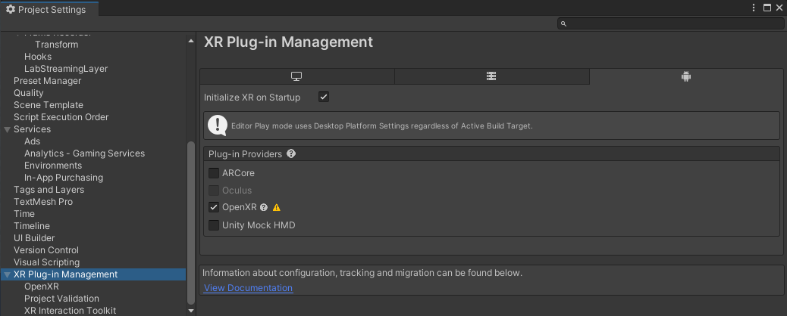

# Project setup

Before jumping into the tutorial, you need to set up the Easter Egg Hunt project in Unity. This section will guide you through downloading the tutorial files, opening the Unity project, and setting up the project for VR. Additionally, you will learn how to set up a physiological signal stream to be used in the Easter Egg Hunt project.

## Download the tutorial files

### Option 1: Download as ZIP

* Go to the [Tutorial GitHub page](https://github.com/liris-xr/PLUME-Tutorial-Basics) and download the repository as ZIP.
* Unpack the downloaded .zip file.

### Option 2: Clone the repository

* Clone the repository using the command line. If Git is not installed on your computer, you can [download it](https://git-scm.com/downloads).
```bash
git clone https://github.com/liris-xr/PLUME-Tutorial-Basics.git
```

## Open the tutorial Unity project

* Open Unity Hub.

!!! Note
    If Unity Hub is not installed on your computer, you can [download it](https://unity.com/download). From Unity Hub, you can install Unity 2022.3 or later. (*Optional*) If you want to build your application on an Android platform (e.g., Meta Quest), make sure to install the Android developer kit when installing Unity.

{width="200", align="right"}

* In Unity Hub, add the project by clicking on `Add -> Add Project From Disk`. Select the Easter Egg Hunt folder located at `PLUME-Tutorial-Basics\Unity\EasterEggHunt`

* Open the Easter Egg Hunt project that has been added to your list of projects.


/// caption
///

!!! note
    If Unity issues a warning regarding the Editor version, you can confidently discard it and continue opening the project.

## VR Setup

To follow along with the Easter Egg Hunt project, you will need to set up your Unity project for VR. The Easter Egg Hunt project is designed to work with VR headsets, you can also use the XR Simulator Device to test the application on desktop if you don't have direct access to a VR headset.

### Option 1: VR HMD

* Click on `Edit -> Project Settings`.
* Under `XR Plug-in Management`, ensure `OpenXR` is enabled.

!!! warning
    In this window, you can manage both Desktop and Android projects. Make sure to configure for the platform you want to build for.



* Select the relevant Interaction Profile. E.g., `Oculus Touch Controller Profile` for Meta Quest.
* Select the relevant OpenXR Feature Groups to enable. E.g., `Meta Quest Support` when building for Meta Quest.


* Close the Project Settings Window.

### Option 2: XR simulator device

{width="400", align="right"}

The [XR Interaction Toolkit (v3.1.0+)](https://docs.unity3d.com/Packages/com.unity.xr.interaction.toolkit@3.1/manual/index.html) provides an easy-to-use simulator of a VR HMD. The simulator prefab is already integrated within the Easter Egg Hunt project. Make sure it is enabled if you want to try the Easter Egg Hunt application on desktop.

## Physiological signal stream setup

### Option 1: Use a physiological device

For this tutorial, you can use your own physiological device and create a LSL stream. Check the [list of supported devices](https://labstreaminglayer.readthedocs.io/info/supported_devices.html). Create your own stream using one of the [numerous implementations of LSL](https://github.com/labstreaminglayer). All the physiological signals stream detected on the network will be picked up by PLUME.

### Option 2: Simulate a physiological signal stream

If you don't have access to a physiological device, we provide you with a Python script (`stream_eda.py`) that simulates one by streaming pre-recorded physiological signals using [PyLSL](https://github.com/labstreaminglayer/pylsl) and [PyXDF](https://github.com/xdf-modules/pyxdf). The script is adapted from a [PyLSL example](https://github.com/labstreaminglayer/pylsl/blob/main/src/pylsl/examples/SendData.py) and sends 2 EDA signals sampled at 8Hz. To run the script, you will need a Python virtual environment with PyLSL and PyXDF installed.

Here is a step-by-step guide to creating a new Python environment using Conda.

* Download and install [Miniconda or Anaconda](https://docs.anaconda.com/getting-started/).
* Open the `Anaconda Prompt` application.
* Create a new Conda environment with Python 3.12.
```
conda create --name my_env python==3.12
```
* Once created, activate the Conda virtual environment.
```
conda activate my_env
```
* In Anaconda Prompt, navigate to the tutorial files, enter the `UnityProject/EasterEggHunt/Assets/PythonScripts~` folder.
* Install the required packages using pip and the following command:
```
pip install -r requirements.txt
```
* Launch `stream_eda.py` using the following command. Physiological streams can now be picked up by PLUME.
```
python stream_eda.py
```


///caption
///