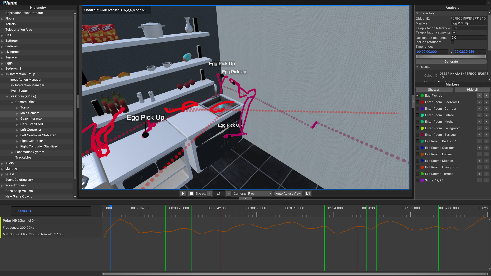
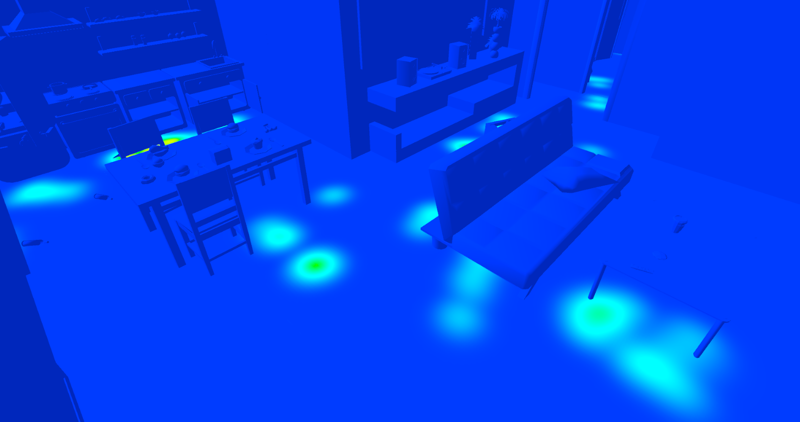
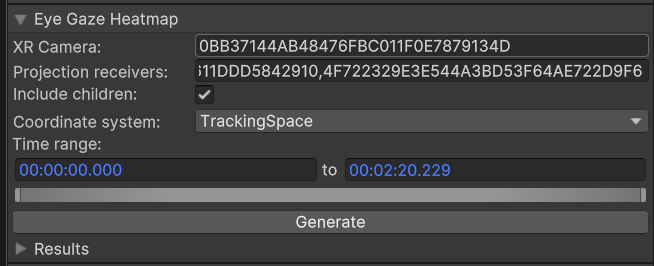
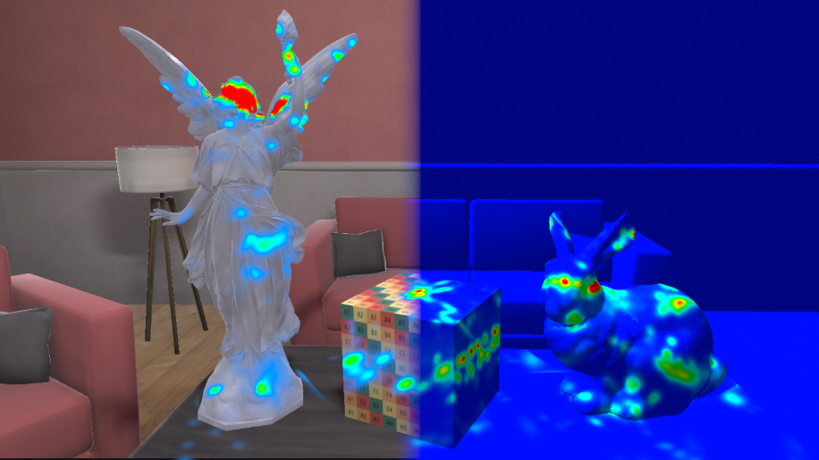
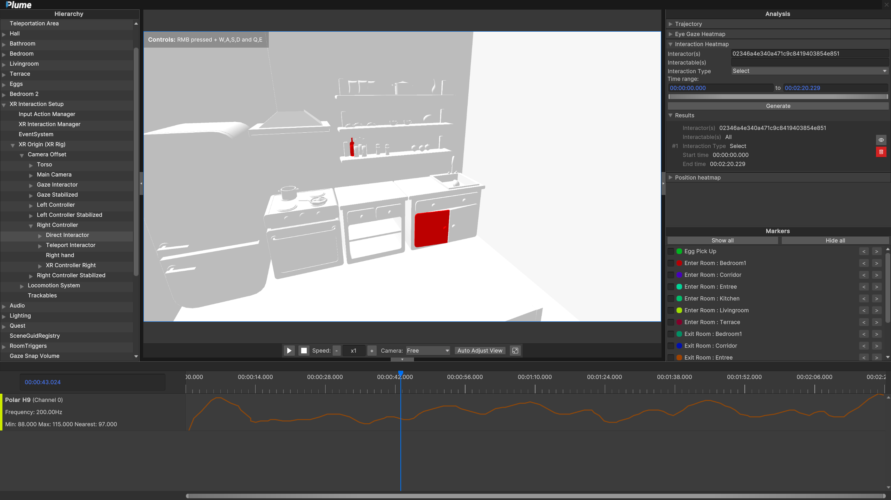

# In-situ analysis of records
PLUME-Viewer is shipped with in-situ analysis modules that produce visuals from data within the context of the recorded virtual environment. 
## Trajectories
With the trajectory module, you can create 3D trajectories of moving objects in the scene.

* Object ID: GUID of the object you want to compute the trajectory for.
* Markers **(Optional)**: name of recorded markers, they are displayed above the trajectory.
* Teleportation tolerance: maximal distance in meter between 2 points before it is considered a teleportation.
* Teleportation segments: if enabled, teleportation will be displayed as dotted lines.
* Decimation Tolerance: largest decimation error (in m) that is allowed during the decimation process of the trajectory polyline.
* Include rotations: if enabled, rotation gizmo will be displayed above the trajectory.
* Time Range: section of the record you want the trajectory to be computed on. Leave as is to take the entire record into account.

    

Click on `Generate` to create the trajectory with selected parameters. The trajectory is colored using a gradient from blue (beginning) to red (end) to indicate its temporality.

    

Generated trajectories can be hidden from view (using eye icon) or deleted (using trash icon).

## Position Heatmaps
With the position module, you can create heatmaps that show where the objects have stayed the most. In practice, the object's position is projected orthogonally towards the ground (-Y axis).

* Projection Caster: GUID of the object you want to compute the heatmap for.
* Projection Receiver: GUID of one or more object for the heatmap to be projected on.
* Include children: if enabled, the projection will include the GUID inserted in 'Projection Receiver' and their children in the hierarchy.
* Time Range: section of the record you want the heatmap to be computed on. Leave as is to take the entire record into account.

    

Click on `Generate` to create the position heatmap with selected parameters. Once computed, position that have been most visitied highlighted. Dark blue means no time spent at this position, Dark Red means most time spent at this position.

    

Generated heatmaps can be hidden from view (using eye icon) or deleted (using trash icon).

## Eye Gaze Heatmaps
With the eye-gaze module, you can create heatmaps that highlight objects that have been looked at. In pratice, the direction of gaze is projected from the position of the eyes in a cone-shaped perspective towards the objects in the scene.

* XR Camera: GUID of the Main Camera object.
* Projection Receiver: GUID of one or more object for the heatmap to be projected on.
* Include children: if enabled, the projection will include the GUID inserted in 'Projection Receiver' and their children in the hierarchy.
* Coordinate System: Tracking Space or Head Space. OpenXR doesn't push a standard for the coordinate system used by HMDs eye-tracker. Depending on your headset, recorded eye-gaze will have a different coordinate system. Meta Quest Pro => Tracking Space; HTC Vive Pro Eye => Head Space.
* Time Range: section of the record you want the heatmap to be computed on. Leave as is to take the entire record into account.

    

Click on `Generate` to create the interaction eye-gaze heatmap with selected parameters. Once computed, objects that have been gazed at directly will be highlighted. Dark blue means no gaze, Dark Red means most time spent gazing at this zone.

    

Generated heatmaps can be hidden from view (using eye icon) or deleted (using trash icon).

## Interactions Highlights
With the interactions module, you can highlight objects that have been interacted with. See more details on how PLUME-Recorder logs interactions in the [XRITK section](../recorder/recorded-data/inputs.md).

* Interactor(s): GUID of one or more interactor.
* Interactable(s) **(Optional)**: GUID of one or more interactable. If empty, every interactable in the scene will be taken into account.
* Interaction type: Interactions as defined by the [XR Interaction Toolkit](https://docs.unity3d.com/Packages/com.unity.xr.interaction.toolkit@2.0/manual/interactable-events.html).  Taking the example of a Direct (or near) Interactor, `Hover` corresponds to touching an interactable, `Select` corresponds to grabbing an interactable, `Activate` is a contextual interaction executed with a selected interactable.
* Time Range: section of the record you want the heatmap to be computed on. Leave as is to take the entire record into account.

    

Click on `Generate` to create the interaction heatmap with selected parameters. Once computed, objects that have been interacted with are highlighted in shades of red. White means no interaction, Dark Red means most number of interactions.

    

Generated heatmaps can be hidden from view (using eye icon) or deleted (using trash icon).